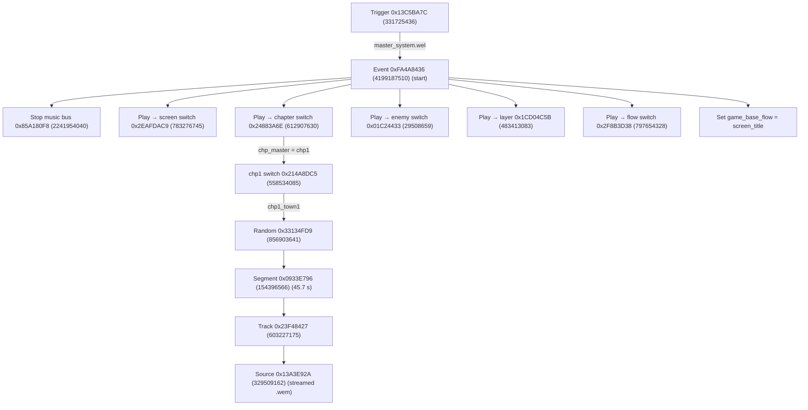

[⬅️ Back to Resident Evil 3](./README.md)

# How the Music Works (non-RT)

Note: Object IDs are what you search for in
REasy's object list when you open `system.bnk.2.stm`: open the bank, go to the
**All Objects** tab, and type an ID like `0x214A8DC5 (558534085)` into the search box.

The step-by-step modding recipes are in [the modding guide](./Sound-Modding.md).

## The whole flow at a glance



Each Play action goes through a small sub-event first; the sub-event IDs are in
the table below.

## The start chain

`master_system.wel` maps trigger `0x13C5BA7C (331725436)` to event `0xFA4A8436 (4199187510)` in
`system.bnk`. That event's actions, in order:

| # | Action | Target | Result |
|---|---|---|---|
| 1 | Stop | `0x85A180F8 (2241954040)` | stops the music bus (defined in `init.bnk`) |
| 2 | Play | `0x312610E7 (824578279)` | plays switch `0x2EAFDAC9 (783276745)` (screen) |
| 3 | Play | `0xFA89F006 (4203343878)` | plays switch `0x24883A6E (612907630)` (chapter) |
| 4 | Play | `0x640B55A6 (1678464422)` | plays switch `0x01C24433 (29508659)` (enemy) |
| 5 | Play | `0x77FC6DB1 (2013031857)` | sets 3 mute groups to `out`, plays `0x1CD04C5B (483413083)`, SetGameParameter `0xAD595813 (2908313619)` = 0 |
| 6 | Play | `0x857164F5 (2238801141)` | plays switch `0x2F8B3D38 (797654328)` (flow) |
| 7 | SetState | `game_base_flow` → `screen_title` | title screen |

"Target" is a small sub-event (type `0x04`, 4); each sub-event's own Play action
points at the switch in the "Result" column. Search for the switch IDs in the
"Result" column when you're tracing this in REasy.

Shut-everything-down event: `0x8CFD7B32 (2365422386)` = Stop all + `chp_master` →
`chp_silence` + Stop `0x24883A6E (612907630)` + `em_master` → `em_silence`.

The title-screen song is not in `system.bnk`. It's in `music_title.bnk`, fired
by `music_title.wel` (triggers `0x3CF5E387 (1022747527)`, `0x62B6EA65 (1656154725)`).

## State groups

States are group → value pairs, stored as case-insensitive FNV-1a hashes.

| Group | Values |
|---|---|
| `chp_master` | `chp0`…`chp5`, `chp3_2`, `chp_silence` |
| `chp0`…`chp5`, `chp3_2` | the cues listed below |
| `em_master` | `em_silence`, `chp2_em00_1`, `chp2_em00_2`, `chp3_bgm_ev321`, `chp4_em00`, `chp4_em33_found`, `chp4_em33_battle` |
| `game_base_flow` | `screen_title`, `screen_loading`, `screen_ingame`, `screen_gameover`, `screen_save`, `screen_pause`, `screen_map`, `screen_inventory`, `screen_character_select`, `screen_camera_select`, `screen_difficulty_select` |
| `bgm_difficulty` | `other`, `unlimited` |
| `bgm_saferoom_room_mute` | `off`, `on` |
| 3 mute groups `0x92197644 (2451142212)` / `0x92197645 (2451142213)` / `0x5B12B94D (1527953741)` | `out`, `in` |
| `Esc_chp3_2_em34` | `em34_true` |

## Master chapter switch `0x24883A6E (612907630)`

Reads `chp_master` (gated by `game_base_flow` = 0, its default value).

| `chp_master` | Target |
|---|---|
| `chp0` | `0x3E64B0EE (1046786286)` |
| `chp1` | `0x214A8DC5 (558534085)` |
| `chp2` | `0x207E79C0 (545159616)` |
| `chp3` | `0x3970DFAC (963698604)` |
| `chp3_2` | `0x029A2387 (43656071)` |
| `chp4` | `0x3F76BB24 (1064745764)` |
| `chp5` | `0x1167467F (291980927)` |
| `chp_silence` / none | `0x286E1985 (678304133)` (silence) |

## Per-chapter cue tables

Each table is one switch. "Target" is the object ID the cue row points at in
that switch's decision tree. Rows with no shipped name are listed at the end of
each table as unnamed hashes.

### chp0 — switch `0x3E64B0EE (1046786286)` (group `chp0`)

| Cue | Target |
|---|---|
| `chp0_start` | `0x02D964A5 (47801509)` |
| `chp0_chase_1st` | `0x3DA40DCB (1034161611)` |
| `chp0_chase_2nd` | `0x01CDD6CC (30267084)` |
| `chp0_chase_3rd` | `0x2CF19098 (754028696)` |
| `chp0_chase_4th_1` | `0x39661304 (962990852)` |
| `chp0_chase_4th_2` | `0x37A823AD (933766061)` |
| `chp0_chase_end_1` | `0x1F55B8A4 (525711524)` |
| `chp0_chase_end_2` | `0x36846571 (914646385)` |
| `chp0_silence` | `0x2C038F9C (738430876)` (silence) |

Unnamed: `0xF9C52544 (4190446916)` → `0x2E748145 (779387205)`.

### chp1 — switch `0x214A8DC5 (558534085)` (group `chp1`)

| Cue | Target |
|---|---|
| `chp1_town1` | `0x33134FD9 (856903641)` |
| `chp1_town2` | `0x0FB23BDB (263338971)` |
| `chp1_Zombie_ev` | `0x2856B8EB (676772075)` |
| `chp1_Zombie_fence1` | `0x3F40E1EB (1061216747)` |
| `chp1_Zombie_fence1_2_1` | `0x39627495 (962753685)` |
| `chp1_Zombie_fence1_2_2` | `0x06B4BB98 (112507800)` |
| `chp1_Zombie_fence1_3_1` | `0x0FA0C3DF (262194143)` |
| `chp1_Zombie_fence1_3_2` | `0x184657D1 (407263185)` |
| `chp1_Zombie_fence2` | `0x1E7CFDFD (511507965)` |
| `chp1_event_heli_car_end` | `0x0EDACFD2 (249221074)` |
| `chp1_bgm_em90_6_end2` | `0x3237EA29 (842525225)` |
| `chp1_silence` | `0x243A8A7E (607816318)` (silence) |

Unnamed: `0x0B43C759 (188991321)` → `0x06974895 (110577813)`, `0x6219F4AE (1645868206)` → `0x1E5B682B (509306923)`,
`0x6D2CB0BE (1831645374)` → `0x2514167E (622073470)`, `0xDD0DDDF4 (3708673524)` → `0x243A8A7E (607816318)`, `0xF1E8C191 (4058562961)` →
`0x1EC72EAC (516370092)`, `0xF1E8C194 (4058562964)`/`0xF1E8C196 (4058562966)`/`0xF1E8C197 (4058562967)` → `0x09DB3B34 (165362484)`.

### chp2 — switch `0x207E79C0 (545159616)` (groups `chp2` + `0x4D59E01C (1297735708)` + `chp2_keyget`)

The second group is a sub-state; most rows use its default (`0`). Rows that
differ are noted.

| Cue | Target |
|---|---|
| `chp2_atmos_01` (sub-state `out`) | `0x2EB5684B (783640651)` |
| `chp2_em30_1` | `0x02C2E7EF (46327791)` |
| `chp2_em30_2` | `0x113F808F (289374351)` |
| `chp2_ev210` | `0x16D0AD24 (382774564)` |
| `chp2_ev210_end` | `0x3F0E6812 (1057908754)` |
| `chp2_ev220` | `0x0D60F01E (224456734)` |
| `chp2_end` | `0x258B2256 (629875286)` |
| `chp2_silence` | `0x2C5A7B1F (744127263)` (silence) |
| (default, sub-state `in`, keyget `true`) | `0x3E09AF77 (1040822135)` (keyget song) |

Unnamed: `0x567D092F (1451034927)` → `0x16D733ED (383202285)`, `0x836A28AA (2204772522)` (sub-state `out`) →
`0x0CD20E50 (215092816)`, `0xB88091FC (3095433724)` → `0x15BB19EC (364583404)`, `0xC1C20C36 (3250719798)` → `0x3BD342B6 (1003700918)`.

### chp3 — switch `0x3970DFAC (963698604)` (groups `chp3` + `0x335DB17A (861778298)` + `chp3_keypick` + `chp3_deimos`)

| Cue | Target |
|---|---|
| `chp3_level0_0` | `0x27FC2DFD (670838269)` |
| `chp3_level0_0_end` | `0x15405DBA (356539834)` |
| `chp3_level0_1` | `0x082D1019 (137170969)` |
| `chp3_level0_2` | `0x2C8731B7 (747057591)` |
| `chp3_level0_2_end` | `0x06A9499B (111757723)` |
| `chp3_level1` | `0x3A7300FB (980615419)` |
| `chp3_level2_1` | `0x290E9F78 (688824184)` |
| `chp3_level2_2` | `0x2C04C518 (738510104)` |
| `chp3_level3_2` | `0x09F0E4EA (166782186)` |
| `chp3_zombie_fence` | `0x068A45A1 (109725089)` |
| `chp3_nemesis_1st` | `0x026B3DA5 (40582565)` |
| `chp3_nemesis_2nd` | `0x11E1EC1D (300018717)` |
| `chp3_nemesis_Outro` | `0x2CF5C72E (754304814)` |
| `chp3_em1000` | `0x1670D880 (376494208)` |
| `chp3_em3500_1_2` | `0x15BB7478 (364606584)` |
| `chp3_em3500_1_3` | `0x095EED37 (157216055)` |
| `chp3_em3500_2` | `0x29BA7E26 (700087846)` |
| `chp3_em3500_3` | `0x10AD7DB0 (279805360)` |
| `chp3_em90_off` | `0x0591925B (93426267)` |
| `chp3_silence` | `0x0646932E (105288494)` (silence) |

`chp3_level3_2` has key/deimos variants: with `chp3_keypick` + `chp3_deimos`
both set it plays `0x2BC951AD (734613933)` (and `0x246D2957 (611133783)` for the keypick-only row).

Unnamed: `0x154C0B28 (357305128)` → `0x1C2D2844 (472721476)`, `0x485B3F10 (1213939472)` → `0x3FF4089C (1072957596)`,
`0x5633EDAF (1446243759)` → `0x2AC61430 (717624368)`, `0xB51248BD (3037874365)` → `0x246D2957 (611133783)` / `0x09F0E4EA (166782186)`,
`0xF9405D70 (4181745008)` → `0x2BC951AD (734613933)` / `0x0646932E (105288494)`.

### chp3_2 — switch `0x029A2387 (43656071)` (groups `chp3_2` + `Esc_chp3_2_em34`)

| Cue | Target |
|---|---|
| `chp3_2_stage` | `0x3800F768 (939587432)` |
| `chp3_2_em90_building` | `0x24F37F1B (619937563)` |
| `chp3_2_em90_building_1st_b` | `0x3989E917 (965339415)` |
| `chp3_2_em90_building_1st_b2` | `0x377A780D (930773005)` |
| `chp3_2_em90_building_1st_d` | `0x00C54BA5 (12929957)` |
| `chp3_2_em90_2_2` | `0x0647E3B8 (105374648)` |
| `chp3_2_em90_2_4` | `0x32569BAA (844536746)` |
| `chp3_2_em90_2_6` | `0x0C0ACB8C (202034060)` |
| `chp3_2_em90_sewer_2nd` | `0x04FB525D (83579485)` |
| `chp3_2_em90_rocket_1st` | `0x05B06EC2 (95448770)` |
| `chp3_2_em90_rocket_3rd` | `0x23D6748A (601257098)` |
| `chp3_2_em90_rocket_5th` | `0x28E8BBB7 (686341047)` |
| `chp3_2_em90_rocket_6th` | `0x20759407 (544576519)` |
| `chp3_2_em90_rocket_7th` | `0x11BF6860 (297756768)` |
| `chp3_2_em90_rocket_8th` | `0x3FDBB812 (1071364114)` |
| `chp3_2_ev350` | `0x26132EF0 (638791408)` |
| `chp3_2_ev351` | `0x07612487 (123806855)` |
| `chp3_2_ev390_1` | `0x2A36C27C (708231804)` |
| `chp3_2_ev390_2` | `0x2F0D217A (789389690)` |
| `chp3_2_em34` | `0x1B31E0DF (456253663)` (`em34_true` → `0x043D0AFA (71109370)`) |
| `chp3_2_silence` | `0x37BFD7A0 (935319456)` (silence) |
| `chp3_2_silence_saferoom` | `0x0078A834 (7907380)` (silence) |

Many unnamed rows exist here (the rocket 2nd/4th variants and similar); they
use only hashes in the data.

### chp4 — switch `0x3F76BB24 (1064745764)` (group `chp4`)

| Cue | Target |
|---|---|
| `chp4_atmos_01` | `0x25CF0C38 (634326072)` (nested switch; `chp4_em00` → `0x3266CE9A (845598362)`) |
| `chp4_atmos_02` | `0x01C5AC46 (29731910)` |
| `chp4_atmos_03` | `0x1AD55B8B (450190219)` |
| `chp4_btl_last_01` | `0x07766C82 (125201538)` |
| `chp4_btl_last_02` | `0x07766C82 (125201538)` |
| `chp4_btl_last_03` | `0x07766C82 (125201538)` |
| `chp4_btl_last_04` | `0x0174D5F7 (24434167)` |
| `chp4_btl_last_05` | `0x0174D5F7 (24434167)` |
| `chp4_btl_last_outro` | `0x051DEF94 (85847956)` |
| `chp4_ev400` | `0x2805898E (671451534)` |
| `chp4_ev401` | `0x0F9BB408 (261862408)` |
| `chp4_ev410` | `0x00CC734A (13398858)` |
| `chp4_2_ev440` | `0x35F237C1 (905066433)` |
| `chp4_2_lv1` | `0x2C419561 (742495585)` (nested switch; `true` → `0x067E74D9 (108950745)`, `false` → `0x16556B65 (374696805)`) |
| `chp4_2_lv2` | `0x14F7C1D0 (351781328)` |
| `chp4_2_lv3_2` | `0x0478B843 (75020355)` |
| `chp4_silence` | `0x0B0C18E3 (185342179)` (silence) |
| `chp4_silence_saferoom` | `0x3C4A7FA3 (1011515299)` (silence) |

Unnamed: `0x848DEBB9 (2223893433)` → `0x2805898E (671451534)`, `0xB6C144A3 (3066119331)` → `0x1C863CB3 (478559411)`.

### chp5 — switch `0x1167467F (291980927)` (group `chp5`)

| Cue | Target |
|---|---|
| `chp5_lv1` | `0x37BBCCA0 (935054496)` |
| `chp5_lv2` | `0x0AF82B84 (184036228)` |
| `chp5_lv3` | `0x21A7C612 (564643346)` |
| `chp5_lv4` | `0x04255B96 (69557142)` |
| `chp5_lv6` | `0x3EA24E9A (1050824346)` |
| `chp5_lv6_outro` | `0x00AEAECA (11448010)` |
| `chp5_chase1_1` | `0x3B55D71D (995481373)` |
| `chp5_chase1_2` | `0x352C8000 (892108800)` |
| `chp5_chase2_1` | `0x35D5E5BE (903210430)` |
| `chp5_chase2_2` | `0x2F620739 (794953529)` |
| `chp5_chase2_3` | `0x0A60C304 (174113540)` |
| `chp5_chase2_3_success` | `0x064B80DD (105611485)` |
| `chp5_chase2_3_failure` | `0x26C8FDEE (650706414)` |
| `chp5_em90_1` | `0x025B009D (39518365)` |
| `chp5_em90_2` | `0x1DF5FE7A (502660730)` |
| `chp5_em90_4` | `0x1AFD52FE (452809470)` |
| `chp5_em90_5` | `0x25C433A2 (633615266)` |
| `chp5_em90_battle1_1` | `0x27BEC57C (666813820)` |
| `chp5_em90_battle2_2` | `0x001BFB80 (1833856)` |
| `chp5_em90_battle2_3` | `0x3AADE81A (984475674)` |
| `chp5_ev520` | `0x102CC98D (271370637)` |
| `chp5_ev580_1` | `0x0F74AB48 (259304264)` |
| `chp5_ev580_2` | `0x2846AC3C (675720252)` |
| `chp5_ev580_3` | `0x366EE3B4 (913236916)` |
| `chp5_staffroll` | `0x2674B017 (645181463)` |
| `chp5_silence` | `0x14275FC6 (338124742)` (silence) |

Unnamed: `0x07C484D9 (130319577)` → `0x2DCB4B3D (768297789)`, `0x7315A140 (1930797376)` → `0x0DFC05DC (234620380)`,
`0x731C5D04 (1931238660)` → `0x008596CF (8754895)`, `0x731C5D05 (1931238661)` → `0x3F14C2B2 (1058325170)`, `0x9CCDD5D6 (2630735318)` →
`0x2BEDD288 (737006216)`, `0xEEDFB697 (4007638679)` → `0x238D652F (596469039)`. (There is no `chp5_lv5`.)

## Enemy switch `0x01C24433 (29508659)` (group `em_master`)

| Cue | Target |
|---|---|
| `em_silence` | `0x30075E1A (805789210)` (silence) |
| `chp2_em00_1` | `0x18B96CCB (414805195)` |
| `chp2_em00_2` | `0x387F5F03 (947871491)` |
| `chp3_bgm_ev321` | `0x21469F3D (558276413)` |
| `chp4_em00` | `0x2E2BCE67 (774622823)` |
| `chp4_em33_found` | `0x0C26BEDD (203865821)` |
| `chp4_em33_battle` | `0x3D078D0F (1023905039)` |

## Screen and flow switches (group `game_base_flow`)

Screen switch `0x2EAFDAC9 (783276745)`:

| `game_base_flow` | Target |
|---|---|
| `screen_title` | `0x3BD5B8E3 (1003862243)` (silent 1 s, no tracks) |
| `screen_loading` | `0x3BD5B8E3 (1003862243)` (silent 1 s) |
| `screen_ingame` | `0x3BD5B8E3 (1003862243)` (silent 1 s) |
| `screen_gameover` | `0x19695C26 (426335270)` (38.5 s music) |

Flow switch `0x2F8B3D38 (797654328)`:

| `game_base_flow` | Target |
|---|---|
| `screen_title` | `0x012DC2A3 (19776163)` (silent 1 s) |
| `screen_loading` | `0x128C12BA (311169722)` (64 s loading music) |
| `screen_ingame` | `0x012DC2A3 (19776163)` (silent 1 s) |

## Save-room and difficulty layer `0x1CD04C5B (483413083)`

Groups: the 3 mute groups (`out`/`in`) + `bgm_saferoom_room_mute`
(`off`/`on`) + `bgm_difficulty` (`other`/`unlimited`). Output bus
`0xC4823CE3 (3296869603)`.

Routes to a chapter-aware chain `0x290F1B9C (688855964)` (chp3) → `0x32252145 (841294149)` (chp3_2) →
`0x073DD10E (121491726)` (chp4) → `0x259CF608 (631043592)` (chp5), or a shared Random `0x3FD3E34A (1070850890)`
(13.7 s / 94 s segments), or silence on `unlimited`.

Bus layout: screen switches → `0x85A180F8 (2241954040)`; chapter/enemy → `0xD25E257A (3529385338)`;
layer → `0xC4823CE3 (3296869603)`.

## Tracing one cue end to end

Every cue is: switch (state → object) → Random/Sequence (`0x0D`, 13) → Segment
(`0x0A`, 10) → Track (`0x0B`, 11) → source (the `.wem`).

`chp1_town1` traced:

```
switch 0x214A8DC5 (558534085), row chp1_town1 → 0x33134FD9 (856903641) (Random)
0x33134FD9 (856903641) → Segment 0x0933E796 (154396566) (45,750 ms)
0x0933E796 (154396566) → Track 0x23F48427 (603227175)
0x23F48427 (603227175) → source 0x13A3E92A (329509162) (streamed from music_resident.pck)
```

The `*_silence` segments are real near-silent clips (~2 s, a few 8–10 s), not
empty objects.

## State value vs `.wss` file name

The ID is the FNV-1a of the value inside the file, not the file name:

| File | Value it holds |
|---|---|
| `chp2_em30_2ormore.wss` | `chp2_em30_2` |
| `bgm_difficulty_other.wss` | `other` |
| `bgm_difficulty_unlimited.wss` | `unlimited` |
| `bgm_saferoom_room_mute_on.wss` | `on` |
| `bgm_saferoom_room_mute_off.wss` | `off` |
| `chp1_zombie_fence1.wss` | `chp1_Zombie_fence1` |

## Names that are not in the files

Only hashes are known for these: mute groups `0x92197644 (2451142212)`, `0x92197645 (2451142213)`,
`0x5B12B94D (1527953741)`; sub-state groups `0x4D59E01C (1297735708)` (chp2) and `0x335DB17A (861778298)` (chp3);
extra mute values `0x78B16582 (2024891778)`, `0xBA08A76B (3121129323)`. Everything else above is named.

---

[⬅️ Back to Resident Evil 3](./README.md) | [⬆️ Top](#how-the-music-works-non-rt)
