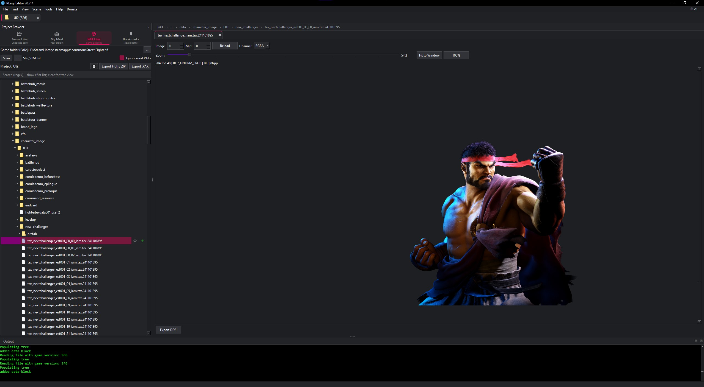
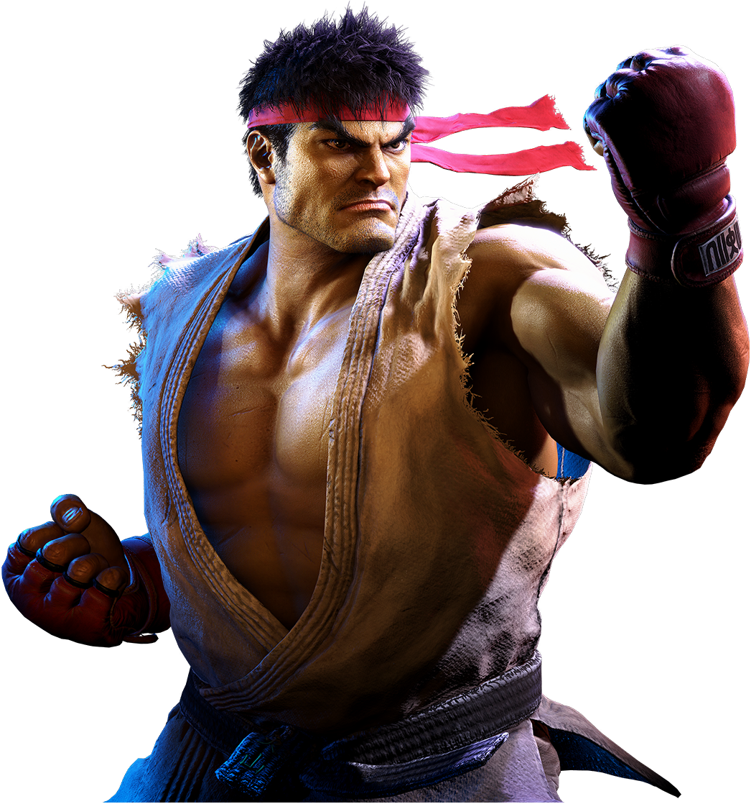
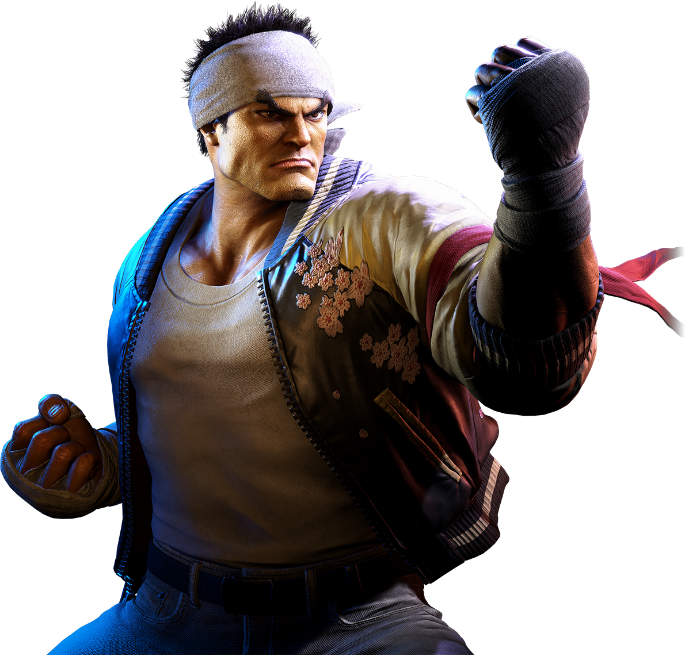
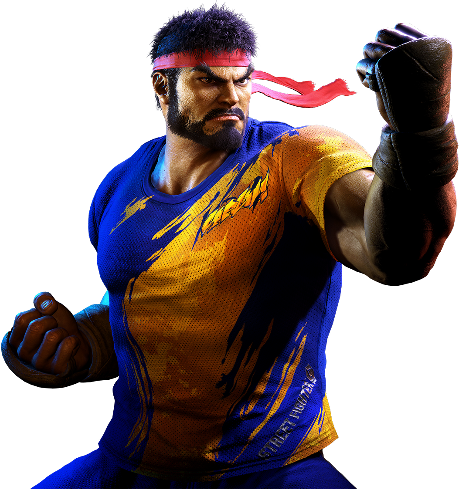
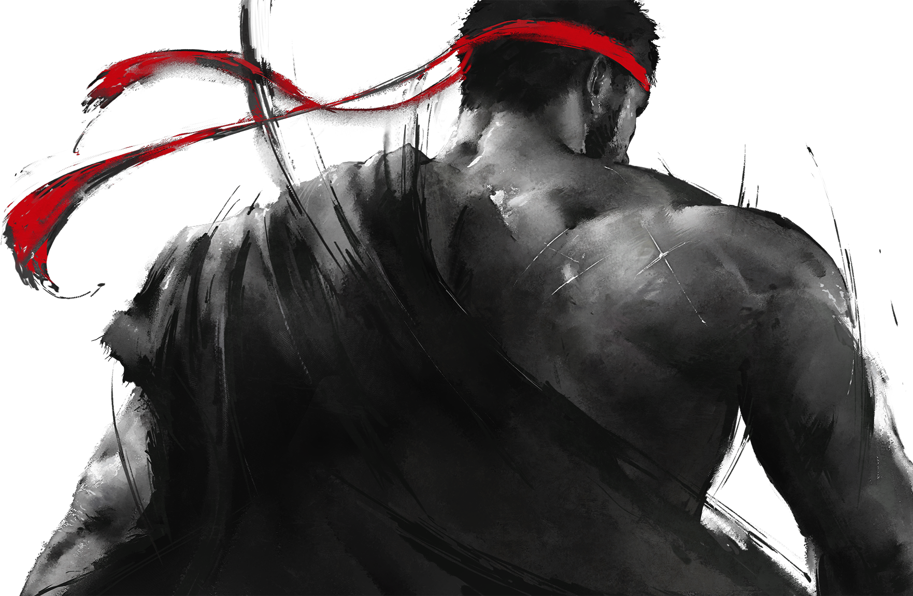
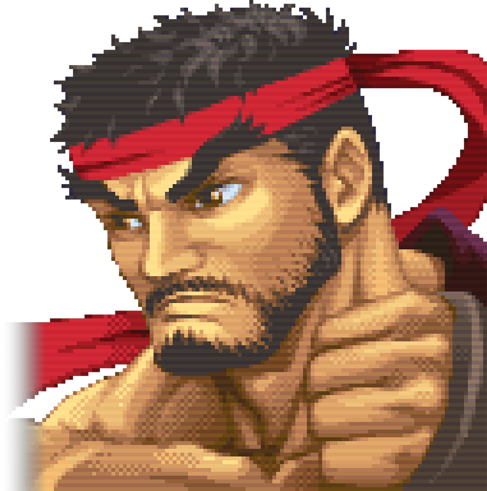
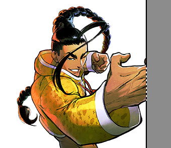
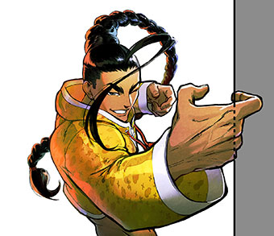
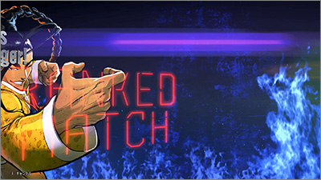
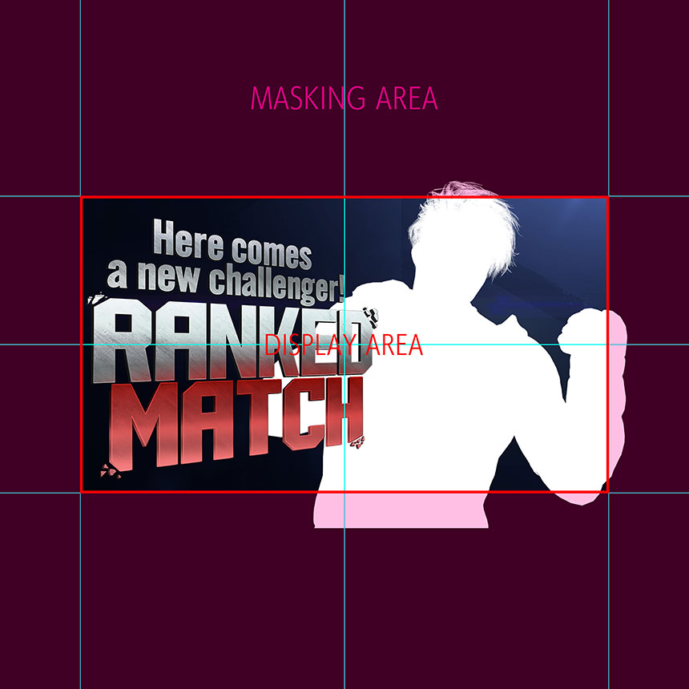

[⬅️ Back to Street Fighter 6](../README.md)

# Replacing "Here Comes a New Challenger" Artwork

This guide explains how to replace the **Here Comes a New Challenger** character artwork in Street Fighter 6 using REasy.

The artwork is stored as `.tex` files inside the game's PAK archives and can be viewed, exported to DDS, edited and added to a REasy project.


<p align="center">
  <br>
</p>


---

## Requirements

Before starting, you will need:

- [REasy](../../../REasy-GUI/Getting-Started.md)
- Street Fighter 6 selected as the game in REasy
- An image editor capable of opening and saving DDS files
- FluffyQuack's REtool for converting DDS files back to RE Engine `.tex`

Recommended DDS editing options:

- [Intel Texture Works Plugin for Adobe Photoshop](https://www.intel.com/content/www/us/en/developer/articles/tool/intel-texture-works-plugin.html)
- [NVIDIA Texture Tools Exporter](https://developer.nvidia.com/texture-tools-exporter)
- [Photopea](https://www.photopea.com/) — free browser-based image editor with DDS support

For Street Fighter 6 character IDs and costume slots, see:

- [Street Fighter 6 File Structure Reference](../SF6-Reference.md)

---

## Create a Project

It is recommended to create a dedicated REasy project for the mod.

For example:

```text
New_Challenger
```

See:

- [Creating a New Project](../../../REasy-GUI/Creating-a-New-Project.md)

Using a project keeps all of the files required by the mod together and allows the finished mod to be exported directly for Fluffy Mod Manager.

---

## Locate the Character Artwork

In the REasy Project Browser, switch to **PAK Files** and browse to:

```text
natives/stm/product/gui/data/character_image/
```

Inside this folder are numbered character folders:

```text
001
002
003
...
033
```

These correspond to the character IDs used by Street Fighter 6.

For example:

```text
001 = Ryu
002 = Luke
003 = Kimberly
...
032 = Ingrid
033 = Yasmine
```

The full list can be found in:

- [Street Fighter 6 File Structure Reference](../SF6-Reference.md#character-codes)

Inside the character folder, open:

```text
new_challenger
```

For example, Ryu's artwork is located under:

```text
natives/stm/product/gui/data/character_image/001/new_challenger/
```
<p align="center">
  <br>
</p>
---

## Character Codes

| Folder | Character |
|---|---|
| `001` | Ryu |
| `002` | Luke |
| `003` | Kimberly |
| `004` | Chun-Li |
| `005` | Manon |
| `006` | Zangief |
| `007` | JP |
| `008` | Dhalsim |
| `009` | Cammy |
| `010` | Ken |
| `011` | Dee Jay |
| `012` | Lily |
| `013` | A.K.I. |
| `014` | Rashid |
| `015` | Blanka |
| `016` | Juri |
| `017` | Marisa |
| `018` | Guile |
| `019` | Ed |
| `020` | E. Honda |
| `021` | Jamie |
| `022` | Akuma |
| `025` | Sagat |
| `026` | M. Bison |
| `027` | Terry |
| `028` | Mai |
| `029` | Elena |
| `030` | C. Viper |
| `031` | Alex |
| `032` | Ingrid |
| `033` | Yasmine |

> `023` and `024` are currently unused as normal character slots.

---

## Understanding the New Challenger Files

The number of New Challenger textures varies by character.

Ryu, for example, has files such as:

```text
tex_nextchallenger_esf001_00_00_iam.tex.241101895
tex_nextchallenger_esf001_00_01_iam.tex.241101895
tex_nextchallenger_esf001_00_02_iam.tex.241101895
tex_nextchallenger_esf001_01_iam.tex.241101895
tex_nextchallenger_esf001_02_iam.tex.241101895
tex_nextchallenger_esf001_26_iam.tex.241101895
```

The costume-related artwork follows this pattern:

```text
tex_nextchallenger_esfXXX_00_00_iam
tex_nextchallenger_esfXXX_00_01_iam
tex_nextchallenger_esfXXX_00_02_iam
tex_nextchallenger_esfXXX_00_04_iam
```

These correspond to outfit artwork.

For example:

```text
00_00 = C1 / Outfit 1
00_01 = C2 / Outfit 2
00_02 = C3 / Outfit 3
00_04 = C4 / Outfit 4
```

Not every character currently has every outfit.

For Ryu:

```text
tex_nextchallenger_esf001_00_00_iam.tex.241101895 = C1
tex_nextchallenger_esf001_00_01_iam.tex.241101895 = C2
tex_nextchallenger_esf001_00_02_iam.tex.241101895 = C3
```

<table> <tr> <td width="33%" align="center"> <br> <em>C2 / Outfit 2</em> </td> <td width="33%" align="center"> <br> <em>C3 / Outfit 3</em> </td> <td width="33%" align="center"> <br> <em>C5 / DriveTech Wear</em> </td> </tr> </table> ```

Ryu does not currently have C4 artwork.

Other commonly used variants include:

```text
tex_nextchallenger_esf001_01_iam.tex.241101895
```

Graffiti artwork.
<p align="center">  </p>

```text
tex_nextchallenger_esf001_02_iam.tex.241101895
```

Pixel artwork.
<p align="center">  </p>

All characters have these variants.

The C5 / DriveTech Wear artwork uses:

```text
tex_nextchallenger_esf001_26_iam.tex.241101895
```

All current characters have a C5 variant.

Other numbered textures can be associated with unlockable, reward or shop artwork.

Because the number of variants differs between characters, it is best to inspect the files for the specific fighter you are modifying rather than assuming every folder contains the same set.

---

## Add the Texture to the Project

Double-click a `.tex` file to preview it in REasy.

Once you have found the artwork you want to replace, add it to the project by either:

- Clicking the green `+` icon beside the file
- Right-clicking the file and choosing **Add to project**

This copies the file into the project while preserving its correct game folder structure.

For example:

```text
REasy-v0.X.X/
└─ projects/
   └─ SF6/
      └─ New_Challenger/
         └─ natives/
            └─ stm/
               └─ product/
                  └─ gui/
                     └─ data/
                        └─ character_image/
                           └─ 001/
                              └─ new_challenger/
```

Keeping the correct folder structure is important because it is the path the game expects when the mod is installed.

---

## Export the Texture to DDS

With the texture open in REasy, click:

```text
Export DDS
```

It is recommended to save the exported DDS beside the corresponding `.tex` file inside the project folder.

This keeps the editable source and the game texture together while you are working.

> Before publishing the mod, remove working files such as DDS, PSD or other source files that are not required by the game.

---

## Open and Edit the DDS

The exported DDS can now be opened in an image editor.

### Adobe Photoshop

Photoshop requires a DDS-capable plug-in.

Recommended options are:

- Intel Texture Works Plugin
- NVIDIA Texture Tools Exporter

### Photopea

Photopea can open and export DDS files directly in the browser.

Go to:

```text
https://www.photopea.com/
```

Then open the exported DDS using:

```text
File → Open
```

---

## Artwork Placement

When replacing the image, it is important to keep the original artwork placement in mind.

The texture contains a larger canvas than the area that is actually displayed during the New Challenger sequence.

The character artwork therefore needs to remain within the composition expected by the game.

The game overlays:

```text
Here comes a new challenger!
RANKED MATCH
```
<table>
  <tr>
    <td width="50%" align="center">
      <br>
      <em>Missing Right Side</em>
    </td>
    <td width="50%" align="center">
      <br>
      <em>Right Side Included</em>
    </td>
  </tr>
</table>

on the left side of the screen, so important parts of the illustration should generally remain toward the centre and right side.

---

## How the Artwork Moves On Screen

The New Challenger artwork is not shown as a completely static image.

Capcom designed the character illustration to **slide into the screen from the left** when the Challenger screen appears.

This means the artwork can extend beyond the visible display area on the right side of the texture.

If your replacement artwork extends past the visible display area, make sure those parts are still included in the texture.

Otherwise, when the image slides into position, the missing section can become visible.

A useful rule is:

```text
Do not crop the artwork to the visible display box.
```

<table>
  <tr>
    <td width="50%" align="center">
      <br>
      <em>Moves from left</em>
    </td>
    <td width="50%" align="center">
      <br>
      <em>To Right</em>
    </td>
  </tr>
</table>

Keep the full illustration intact even when part of it sits outside the area shown on screen.

Capcom's own artwork documentation demonstrates this behaviour:

[Street Fighter 6 New Challenger Artwork Placement Video](https://www.youtube.com/watch?v=X-VW5BLimXo)

---

## Capcom PSD Template

Capcom provides an official Photoshop template that shows the intended display area and masking area for this artwork.

<p align="center">
  <br>
</p>


### Design Template

[Download the official Design Contest Format](https://www.streetfighter.com/6/buckler/assets/images/artcontest/psd/DesignContest_Format.zip)

The template includes guides showing:

```text
DISPLAY AREA
MASKING AREA
```

This makes it useful even outside the original artwork contest, because the same layout demonstrates how the Challenger artwork is positioned in-game.

### Example Kit

Capcom also provides an example kit:

[Download the official Design Contest Kit](https://www.streetfighter.com/6/buckler/assets/images/artcontest/psd/DesignContest_Kit.zip)

This includes example artwork showing how illustrations should extend beyond the visible display area.

> These links are hosted by Capcom and may change or be removed in the future.

---

## DDS Export Settings

For these New Challenger textures, use:

```text
Texture Type: Color + Alpha
Compression: BC7 8bpp Fine (sRGB, DX11+)
Mip Maps: None
```

In Intel Texture Works this appears as:

```text
Texture Type
    Color + Alpha

Compression
    BC7 8bpp Fine (sRGB, DX11+)

Mip Maps
    None
```

Do not generate mip maps for this texture.

The alpha channel should also be preserved, as it is used by the artwork transparency.

---

# Convert the Edited DDS Back to TEX

Once the artwork has been edited and saved as DDS, it needs to be converted back into Street Fighter 6's `.tex` format.

A commonly used tool for this is **REtool** by FluffyQuack.

For this workflow, the easiest method is to place:

```text
REtool.exe
```

inside the same folder as the DDS you are converting.

You should also keep the original `.tex` file beside it.

For example:

```text
new_challenger/
├─ REtool.exe
├─ tex_nextchallenger_esf001_00_00_iam.dds
└─ tex_nextchallenger_esf001_00_00_iam.tex.241101895
```

The DDS and TEX should use the same base filename.

For example:

```text
tex_nextchallenger_esf001_00_00_iam.dds
tex_nextchallenger_esf001_00_00_iam.tex.241101895
```

---

## Convert with REtool

To convert the DDS:

1. Save your finished artwork as DDS using the settings above.
2. Make sure `REtool.exe` is in the same folder.
3. Make sure the original matching `.tex` file is also present.
4. Drag the DDS file directly onto:

```text
REtool.exe
```

REtool will use the matching `.tex` file as the reference and convert the DDS back into the correct RE Engine texture format.

After conversion, the resulting `.tex` file can be used by the game.

> Keeping the original `.tex` beside the DDS is important because it provides REtool with the texture format and version information required for the conversion.

---

# Test the Mod

Once the converted `.tex` file is back inside the REasy project, the mod can be packaged for testing.

In REasy click:

```text
Export Fluffy ZIP
```

This creates a mod archive that can be installed with Fluffy Mod Manager.

For more information, see:

- [Fluffy Mod Manager Export](../../../REasy-GUI/Fluffy-Mod-Manager.md)

Install the ZIP in Fluffy Mod Manager, enable the mod and launch Street Fighter 6.

Trigger the **Here Comes a New Challenger** screen and check:

- Artwork position
- Scale
- Cropping
- Transparency
- Slide-in animation
- Whether anything important is hidden behind the Ranked Match graphic

It is common to make a few adjustments before the artwork lines up exactly as intended.

---

## Working Files During Testing

While developing the mod, it is fine to leave working files inside the REasy project folder.

For example:

```text
REtool.exe
.dds
.psd
```

These files are not used by Street Fighter 6 and normally will not prevent the mod from working when installed through Fluffy Mod Manager.

However, REasy packages the contents of the project when exporting a Fluffy ZIP.

Before publishing the finished mod, remove any files that are not required by the game, such as:

```text
REtool.exe
.dds
.psd
.blend
backup files
temporary files
```

This keeps the finished mod archive clean and reduces its size.

---

## Basic Workflow Summary

```text
Open PAK Files in REasy
        ↓
Find character_image/XXX/new_challenger/
        ↓
Preview the TEX
        ↓
Add the TEX to the project
        ↓
Export DDS
        ↓
Edit the DDS
        ↓
Keep artwork within the intended composition
        ↓
Save as BC7 / No Mip Maps
        ↓
Drag DDS onto REtool.exe
        ↓
Convert back to TEX
        ↓
Export Fluffy ZIP
        ↓
Install and test in Fluffy Mod Manager
```

---

[⬅️ Back to Street Fighter 6](../README.md) | [⬆️ Top](#replacing-here-comes-a-new-challenger-artwork)
