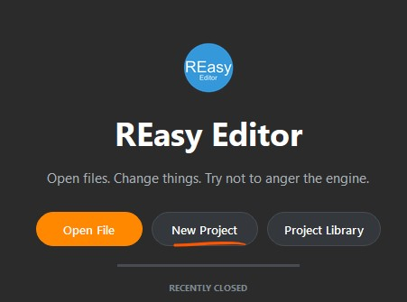
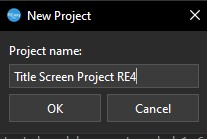
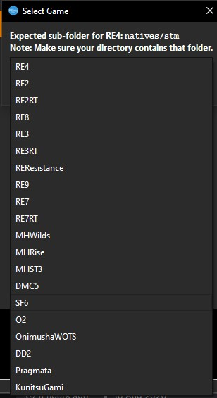
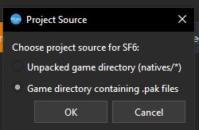
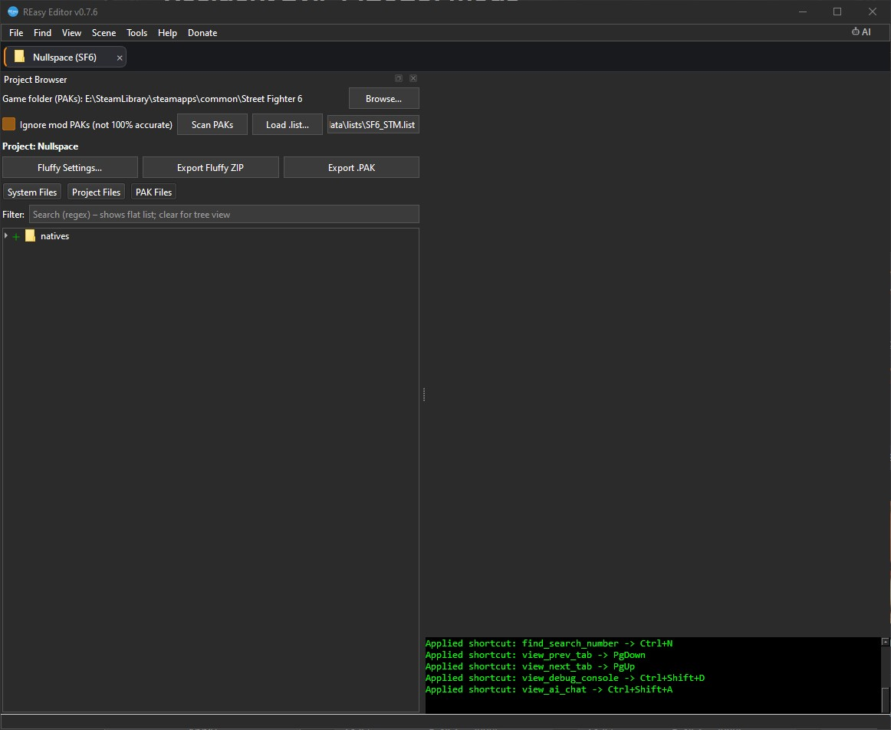

[⬅️ Back to REasy GUI Documentation](./README.md)

# Creating a New Project

Projects allow REasy to work directly with a game's files and provide an easier way to browse, search and open files without manually extracting the entire game first.

This guide covers creating a new project from an installed game.

---

## 1. Create a New Project

From the REasy landing page, click:

**New Project**

<p align="left">
  <br>
  <em>Captured in REasy 0.7.6</em>
</p>

REasy will ask you to enter a name for the new project.

---

## 2. Give Your Project a Name

Enter a name that will make the project easy to identify later.

For example:

`Street Fighter 6`

or:

`SF6`

The project name does not have to match the game's executable or folder name.

Once you have entered a name, click **OK**.

<p align="left">
  <br>
  <em>Captured in REasy 0.7.6</em>
</p>

---

## 3. Select the Game

REasy will now ask which game the project is for.

<p align="left">
  <br>
  <em>Captured in REasy 0.7.6</em>
</p>

Select the game from the list.

For example, for **Street Fighter 6**, select:

`SF6`

It is important to select the correct game because REasy uses game-specific file information when reading and browsing the game's data.

> For **Resident Evil 2, Resident Evil 3 and Resident Evil 7**, make sure you select the correct RT or non-RT version of the game.
>
> See the [Getting Started](./Getting-Started.md#resident-evil) guide for more information.

---

## 4. Select the Project Source

REasy will ask where the project should load its game files from.

Two options are available:

### Unpacked Game Directory

Choose this option if you already have the game's files extracted into a directory.

This is useful when working from a previously unpacked game or an existing extracted file structure.

### Game Directory Containing .PAK Files

For most users, this is the **recommended option**.

Select:

**Game directory containing .pak files**

<p align="left">
  <br>
  <em>Captured in REasy 0.7.6</em>
</p>

This allows REasy to browse the game's files directly from its PAK archives without requiring you to unpack the entire game first.

Click **OK** to continue.

---

## 5. Select the Game Directory

Browse to the game's installation directory.

You need to select the folder containing the game's main `.pak` file.

For example, a Steam installation may look similar to:

```text
...\SteamLibrary\steamapps\common\Street Fighter 6\
```

The exact location will depend on where the game is installed and which store or launcher you use.

Select the folder containing the main game PAK and confirm the folder selection.

> Select the **game installation folder containing the PAK files**, not a `natives` mod folder.

---

## 6. Project Created

REasy will now create the project and begin loading the available game file information.

Once complete, the project will open and you can begin browsing the game's files.

<p align="left">
  <br>
  <em>Captured in REasy 0.7.6</em>
</p>

Your project will also be available from the **Project Library**, allowing you to reopen it later without repeating the setup process.

---

## Next Steps

Your REasy project is now ready to use.

The next guide will cover working with the project browser, including:

- Browsing folders
- Searching for files
- Opening supported files
- Extracting files
- Working with the Project Library

---

[⬅️ Back to REasy GUI Documentation](./README.md) | [Getting Started](./Getting-Started.md) | [Settings](./Settings.md) | [⬆️ Top](#creating-a-new-project)
