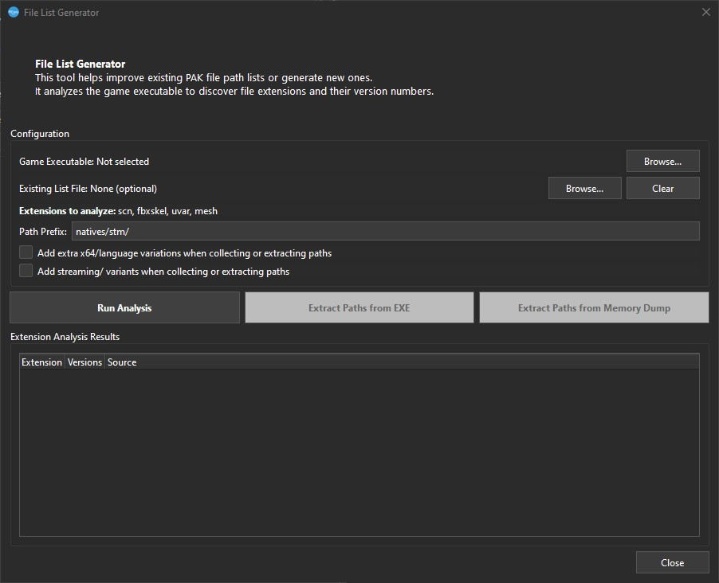
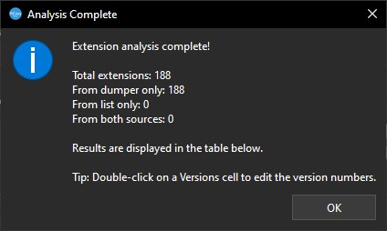
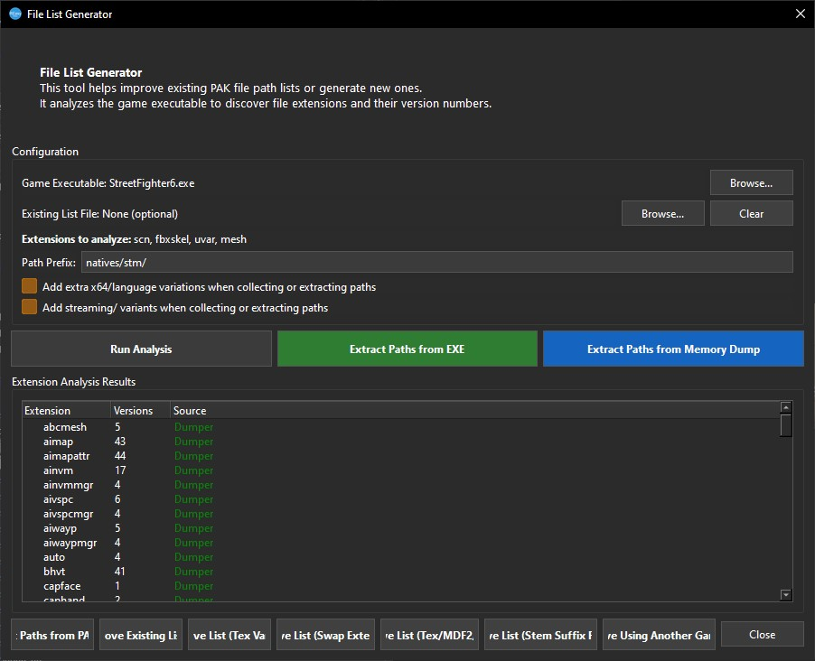

[⬅️ Back to REasy GUI Documentation](./README.md)

# File List Generator

The **File List Generator** helps create or improve `.list` files used for browsing game PAK archives.

It can analyse a game's executable to identify file extensions and the version numbers used by that specific RE Engine game.

Open the tool from:

**Tools → File List Generator**

<p align="left">
  <br>
  <em>Captured in REasy 0.7.6</em>
</p>

---

## 1. Select the Game Executable

Under **Configuration**, next to:

**Game Executable**

click:

**Browse...**

Navigate to the game's executable.

This is normally located in the game's main installation folder.

For example, for Street Fighter 6:

```text
...\SteamLibrary\steamapps\common\Street Fighter 6\StreetFighter6.exe
```

Select the executable and open it in the File List Generator.

---

## 2. Run Analysis

Once the game executable has been selected, click:

**Run Analysis**

REasy will analyse the executable and attempt to identify the file extensions and version numbers used by the game.

When the analysis has completed, the results will appear under:

**Extension Analysis Results**

The results contain three columns:

- **Extension**
- **Versions**
- **Source**

<p align="left">
  <br>
  <em>Captured in REasy 0.7.6</em>
</p>

---

## Understanding File Extensions and Versions

RE Engine files commonly use a filename structure containing:

```text
filename.extension.version
```

For example:

```text
20101.mov.1
```

This can be broken down as:

| Part | Value | Meaning |
|---|---|---|
| Filename | `20101` | The name or identifier of the file |
| Extension | `.mov` | The file type |
| Version | `.1` | The version of that file format used by the game |

Another example is a texture file:

```text
example.tex.241101895
```

Here:

- `example` is the filename.
- `.tex` identifies it as a texture.
- `.241101895` is the texture format version used by that game.

The version number is important because different RE Engine games — and sometimes different revisions of the same game — use different versions of the same file format.

For example, Street Fighter 6 currently uses file versions including:

```text
.tex.241101895
.mesh.230110883
```

Other RE Engine titles can use different `.tex`, `.mesh` and other file-format versions.

The **File List Generator** detects these values from the selected game's executable so that paths can be generated using the correct file extensions and versions.

### Examples Across RE Engine Games

Different RE Engine games use different version suffixes for the same file type.

| Game | Mesh | Texture |
|---|---|---|
| Resident Evil 2 | `.mesh.1808312334` | `.tex.10` |
| Devil May Cry 5 | `.mesh.1808282334` | `.tex.11` |
| Resident Evil 3 | `.mesh.1902042334` | `.tex.190820018` |
| Resident Evil Village | `.mesh.2101050001` | `.tex.30` |
| Monster Hunter Rise | `.mesh.2008058288` | `.tex.28` |
| Monster Hunter Rise: Sunbreak | `.mesh.2109148288` | `.tex.28` |
| Resident Evil 2 / 3 RT | `.mesh.2109108288` | `.tex.34` |
| Resident Evil 7 RT | `.mesh.220128762` | `.tex.35` |
| Resident Evil 4 | `.mesh.221108797` | `.tex.143221013` |
| Street Fighter 6 | `.mesh.230110883` | `.tex.241101895` |
| Dragon's Dogma 2 | `.mesh.231011879` | `.tex.760230703` |

Street Fighter 6 also used an earlier texture version:

```text
.tex.143230113
```

before later updates moved to:

```text
.tex.241101895
```

This is why the version suffix matters when building or improving a `.list` file: a path may be correct, but it will still fail to match the packed file if the extension version is wrong.

---

## 3. Review the Analysis Results

After analysis, the results list will show the file formats detected for the selected game.

<p align="left">
  <br>
  <em>Captured in REasy 0.7.6</em>
</p>

For example, you may see entries such as:

| Extension | Version | Source |
|---|---:|---|
| `mesh` | `230110883` | Dumper |
| `mdf2` | `31` | Dumper |
| `mot` | `603` | Dumper |

The exact results depend on the game being analysed.

The **Source** column shows how REasy obtained the version information.

---

## Existing List File

The **Existing List File** field is optional.

If you already have a `.list` file for the game, you can load it here and use the File List Generator to improve or expand the existing list rather than starting from nothing.

This is useful when a current list already contains many known paths but is missing newer or undiscovered files.

---

## Path Prefix

The default path prefix is:

```text
natives/stm/
```

This is the standard root path used by many PC RE Engine game files.

In most cases this can be left at its default value.

---

## Additional Path Options

Two additional options are available when collecting or extracting paths.

### Add extra x64/language variations

Adds additional path variations relating to `x64` and language-specific versions of files.

This can help locate regional or language variants that may not otherwise be included in the generated list.

### Add streaming/variants

Adds paths for **streaming** and other known path variants while collecting or extracting file paths.

RE Engine games commonly use streaming paths for assets that are loaded on demand. Depending on the file type and game, these can include:

- Higher-quality or full-resolution textures
- Full audio or streaming audio banks
- Video files
- Other streamed game assets

For this reason, **Add streaming/variants is recommended when building a new `.list` file**, as excluding streaming paths can leave useful game assets undiscovered.

---

## Generating and Improving File Paths

Once **Run Analysis** has completed, additional path extraction and list-improvement tools become available.

---

## Extract Paths from EXE

Click:

**Extract Paths from EXE**

REasy will process strings found within the selected game executable and attempt to identify usable game file paths.

When the extraction is complete, you will be prompted to save the results as a `.txt` file.

This can reveal file paths referenced directly by the game's executable and provide a useful starting point when creating or improving a `.list` file.

---

## Extract Paths from Memory Dump

Click:

**Extract Paths from Memory Dump**

This allows you to analyse a memory dump created while the game is running.

To create a memory dump in Windows:

1. Open **Task Manager**.
2. Find the running game process.
3. Right-click the process.
4. Select **Create memory dump file**.
5. Wait for Windows to finish creating the dump and note the saved file location.

Back in REasy, select the generated memory dump file.

- `.dmp`
- `.bin`
- `.mdmp`

REasy will process the dump for usable paths and allow the results to be saved as a `.txt` file.

Memory dumps can contain file paths that were loaded, referenced or held in memory during gameplay, including paths that may not be present as plain strings inside the executable.

> Memory dumps captured at different points in the game may contain different paths. For example, loading a particular stage, character or game mode before creating the dump can expose paths associated with that content.


## List Improvement Tools

After analysis, several additional tools appear along the bottom of the File List Generator.

These can be used to collect more paths or improve an existing `.list`.

### Collect Paths from PAK Files

**Collect Paths from PAK Files** uses the game's PAK archives as another source when collecting paths.

This can be combined with information discovered from the executable and other sources when building the game's file list.

### Improve Existing List

**Improve Existing List** is available when an optional **Existing List File** has been supplied.

REasy uses the existing list as a starting point and attempts to discover and add additional paths.

This is useful when updating an older or incomplete `.list` rather than generating everything from scratch.

### Improve List (Tex Variants)

Attempts to discover additional texture path variants based on texture entries already known to the list.

This can help expand coverage of `.tex` files where related paths follow predictable naming or location patterns.

### Improve List (Swap Extensions)

Attempts alternate file extensions against known paths.

RE Engine resources are often related through similar filenames or paths while using different extensions, so testing known paths with other detected extensions can reveal additional files.

### Improve List (Tex/MDF2/Mesh)

Attempts to find related:

- `.tex` textures
- `.mdf2` material files
- `.mesh` model files

These file types are commonly associated with one another, making known paths useful when searching for related resources.

### Improve List (Stem Suffix Probes)

Attempts additional filename variations based on known file-name stems and suffix patterns.

This can help discover files that use a common base name with numbered or named variations.

### Improve Using Another Game List

Allows an existing `.list` from another RE Engine game to be used as an additional source for finding possible paths.

This can be particularly useful when a **new game or sequel is released**.

Games from the same series, or games built from related versions of the RE Engine, can retain similar directory structures and naming conventions.

For example, when a new **Monster Hunter** title is released, an existing list from another Monster Hunter game may provide useful path names or patterns that can be tested against the new game.

Not every path from another game will exist, but it can provide a useful starting point for discovering shared or reused structures.

---

## Building a Better `.list`

The File List Generator provides several different sources of information:

- Game executable analysis
- Paths extracted from the executable
- Memory dumps
- Game PAK files
- Existing `.list` files
- Related paths inferred from known extensions and filenames
- `.list` files from other games

Using several of these methods together can produce a much more complete file list than relying on a single source.

A `.list` does not necessarily contain every file path used by the game, so lists can continue to improve as additional paths are discovered.

---

## Related Notes

The File List Generator and REasy file-list support continue to improve across new REasy versions.

For example, REasy 0.7.0 included updates such as:

- MHST3 support, including a file list.
- Updated MHWilds file list.
- Updated RE9 file list.
- Updated SF6 file list.
- Improved auto-detection of file lists when selecting a directory in PAK Browser.
- Added more paths to the Onimusha 2 file list.

This is one reason it is a good idea to keep REasy up to date, especially when working with newer games or recently updated file lists.

---

[⬅️ Back to REasy GUI Documentation](./README.md) | [⬆️ Top](#file-list-generator)
