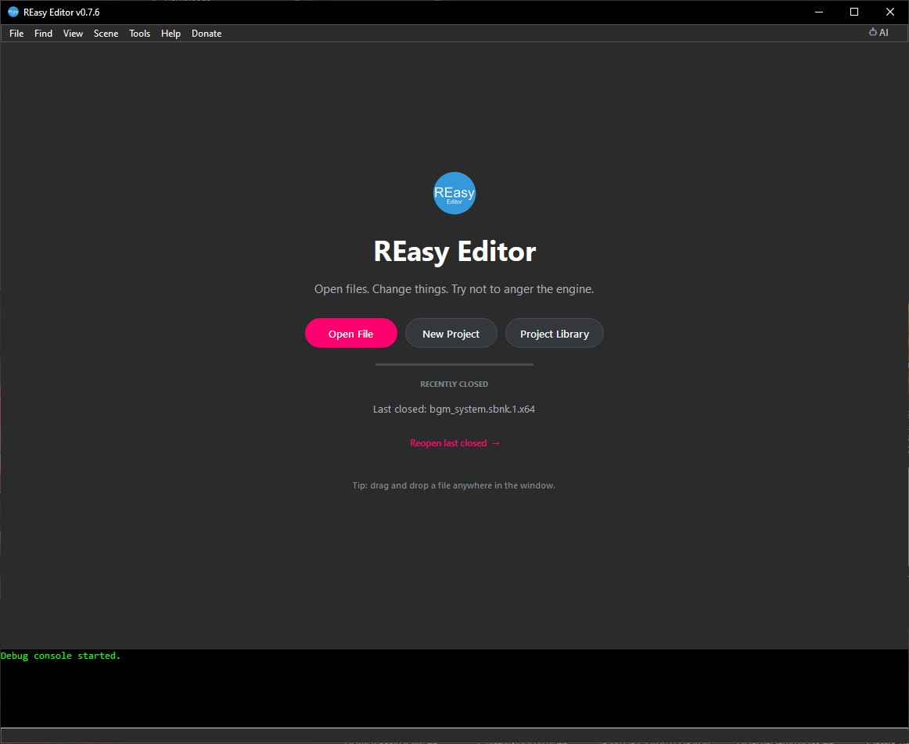
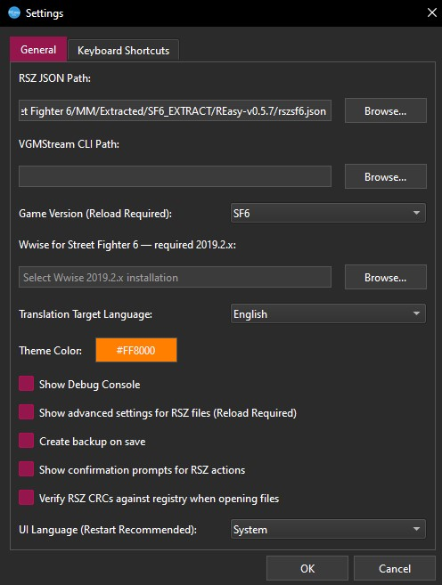
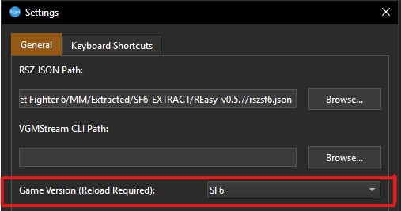
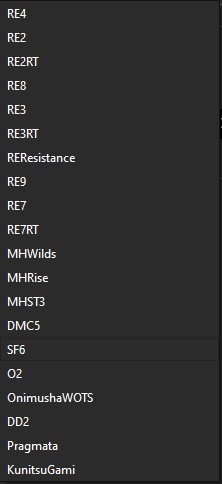

[⬅️ Back to REasy GUI Documentation](./README.md)

# Getting Started: Setup REasy

Welcome to the REasy GUI!

REasy is an editor and modding tool for games built with Capcom's **RE Engine**, allowing supported game files to be opened, viewed and edited through a graphical interface.

**REasy GUI is currently available in English and Chinese.**

This guide covers downloading or building REasy, launching it for the first time, selecting the game you are working with, and configuring the basic settings needed before you begin.

---

## 1. Download or Build REasy

You can get REasy in two ways:

### Option A: Download Ready-to-Use

For most users, this is the recommended option.

Visit the official REasy releases page:

**[Download the latest REasy release](https://github.com/seifhassine/REasy/releases)**

Download the latest release archive and extract it to a folder of your choice.

REasy is portable and does not require a traditional installation.

Once extracted, the program can be launched directly from its folder.

### Option B: Build REasy from Source

Advanced users can also build REasy directly from the source code.

Visit the official repository:

**[REasy GitHub Repository](https://github.com/seifhassine/REasy)**

The repository contains the source code, required Python dependencies and current build instructions.

Follow the instructions in the repository README to build REasy yourself.

---

## 2. Launch REasy

Open the extracted REasy folder and launch:

`REasy_x64.exe`

or the appropriate executable for your operating system/build.

The main **REasy Editor** landing page will appear.

  

From the landing page you can:

- **Open File** — Open an individual supported game file.
- **New Project** — Create a new project for browsing and working with a game's files.
- **Project Library** — Open and manage projects you have previously created.
- **Reopen Last Closed** — Quickly reopen the most recently closed file.
- **Drag and Drop** — Drop a supported file anywhere into the REasy window to open it.

A current list of supported file formats can be found in the main REasy repository:

**[REasy Supported Features and File Types](https://github.com/seifhassine/REasy?tab=readme-ov-file#features)**

Before opening files or creating your first project, it is recommended that you check the REasy settings.

---

## 3. Configure REasy

From the menu bar, open:

**File → Settings**

 

   
  <em>Captured in REeasy 0.7.6</em>
 

REasy now includes the required **RSZ JSON data** with the program, and this data is maintained and updated alongside REasy.

Unlike older versions of REasy, a new user does **not** normally need to download an RSZ JSON file separately or manually configure the RSZ JSON path.

For a basic setup, the most important settings are:

- **Game Version**
- **Translation Target Language**
- **UI Language**

### Game Version

 

   
 

Select the game you intend to work with.

This is important because RE Engine games use different file versions, structures and data depending on the game and engine revision.

For example, if you are working with **Street Fighter 6**, select:

`SF6`

Changing the selected game requires REasy to reload the relevant game data.

REasy supports a large selection of Capcom RE Engine titles.

Current selections include:

#### Resident Evil

- `RE2` — Resident Evil 2
- `RE2RT` — Resident Evil 2 Ray Tracing
- `RE3` — Resident Evil 3
- `RE3RT` — Resident Evil 3 Ray Tracing
- `RE4` — Resident Evil 4
- `RE7` — Resident Evil 7
- `RE7RT` — Resident Evil 7 Ray Tracing
- `RE8` — Resident Evil Village
- `RE9` — Resident Evil Requiem
- `REResistance` — Resident Evil Resistance

#### Monster Hunter

- `MHRise` — Monster Hunter Rise
- `MHWilds` — Monster Hunter Wilds
- `MHST3` — Monster Hunter Stories 3

#### Other RE Engine Games

- `DMC5` — Devil May Cry 5
- `SF6` — Street Fighter 6
- `O2` — Onimusha 2
- `OnimushaWOTS` — Onimusha: Way of the Sword
- `DD2` — Dragon's Dogma 2
- `Pragmata` — Pragmata
- `KunitsuGami` — Kunitsu-Gami: Path of the Goddess

 

   
 

> **Resident Evil 2, Resident Evil 3 and Resident Evil 7**
>
> These games have separate original and **RT** entries because Capcom later updated them to newer RE Engine versions with Ray Tracing support.
>
> If you are using the current updated version of the game, select:
>
> `RE2RT`, `RE3RT` or `RE7RT`
>
> If you have chosen to use the older non-Ray-Tracing version of the game, select:
>
> `RE2`, `RE3` or `RE7`
>
> The selected version should match the version of the game files you are modding.

### Translation Target Language

Choose the language REasy should use when displaying translated game data.

For example:

`English`

This setting affects translated game data shown by REasy and is separate from the language used by the REasy interface itself.

### UI Language

This controls the language of the **REasy interface**.

The default setting is:

`System`

When set to **System**, REasy will use the appropriate supported interface language based on your operating system language.

REasy GUI currently supports:

- English
- Chinese

You can also select a supported UI language manually.

---

## 4. Save Your Settings

Once you have selected the correct:

- **Game Version**
- **Translation Target Language**
- **UI Language**, if you do not want to use `System`

click **OK**.

If REasy indicates that a reload or restart is required for a changed setting, allow it to reload the relevant data.

REasy is now configured and ready to use.

---

## 5. Start Using REasy

You can now return to the REasy landing page and begin working with game files.

There are two main ways to get started:

### Open an Individual File

Click **Open File**, or simply drag and drop a supported file into the REasy window.

This is useful when you already have an extracted game file that you want to inspect or edit.

### Create a Project

For working directly with a complete game installation, select:

**New Project**

Projects allow REasy to work with the game's file structure and browse files from the game's PAK archives.

Project setup is covered in the next guide:

**Creating Your First REasy Project**

---

## Troubleshooting

If REasy does not behave as expected:

- Make sure you are using the latest version of REasy.
- Make sure the correct **Game Version** is selected.
- If working with Resident Evil 2, Resident Evil 3 or Resident Evil 7, check that you selected the correct **RT or non-RT** version.
- Leave the **Debug Console** enabled, as error information shown there may help identify the problem.
- Check the REasy GitHub repository for updated information.

If you believe you have found a bug, report it through the official issue tracker:

**[REasy Issues](https://github.com/seifhassine/REasy/issues)**

---

[⬅️ Back to REasy GUI Documentation](./README.md) | [⬆️ Top](#getting-started-setup-reasy)

