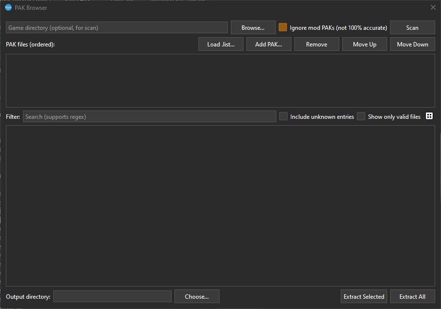
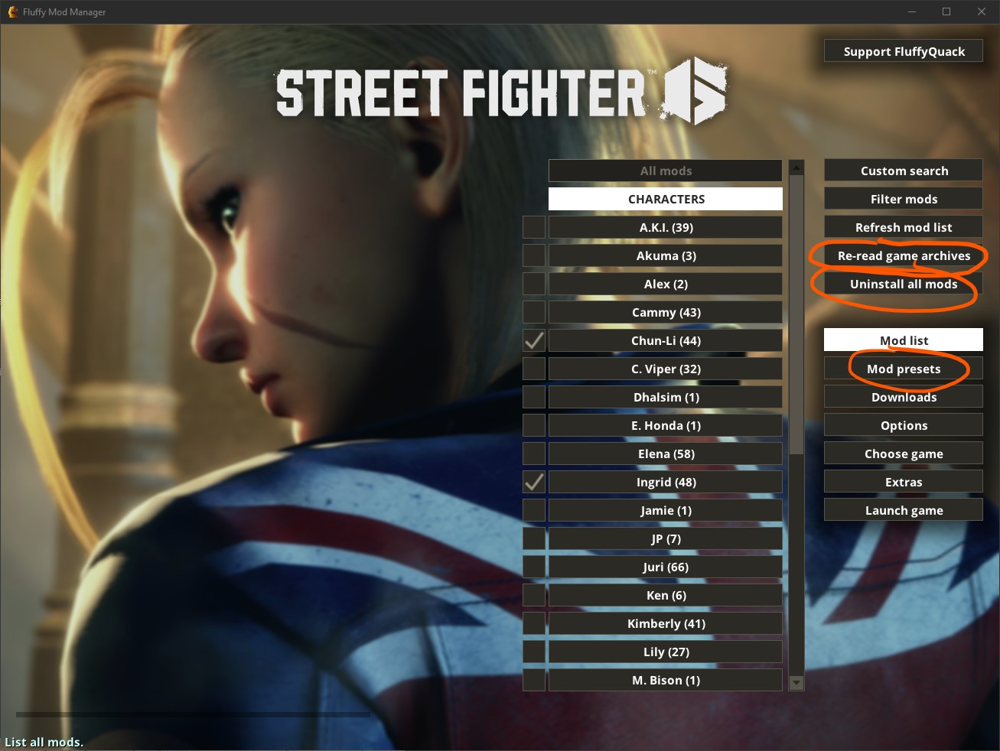
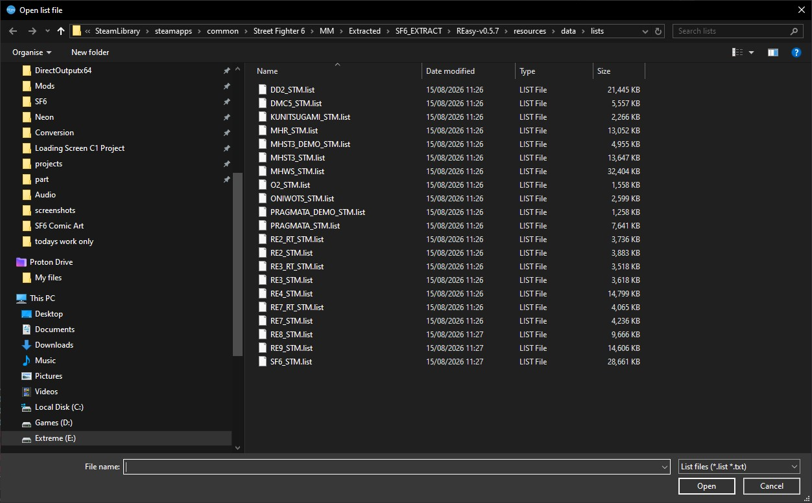
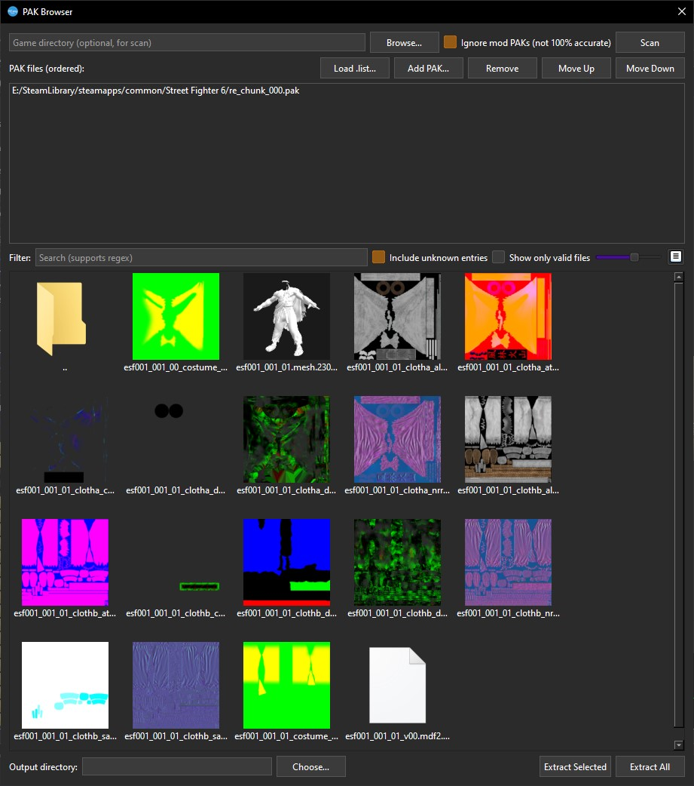

[⬅️ Back to REasy GUI Documentation](./README.md)

# PAK Browser

The **PAK Browser** lets you browse and extract files directly from a game's `.pak` archives without unpacking the entire game first.

Open the tool from:

**Tools → PAK Browser**

<p align="left">
  <br>
  <em>Captured in REasy 0.7.6</em>
</p>

---

## Important: Uninstall Mods Before Scanning

Before using the PAK Browser, it is recommended to temporarily uninstall any active mods.

If you use **Fluffy Mod Manager**, you can first save your current mod setup as a preset, then uninstall all active mods.

In Fluffy Mod Manager:

1. Save your current mod setup if required.
2. Click **Uninstall all mods**.
3. Click **Re-read game archives**.

<p align="left">
  <br>
</p>

This helps ensure REasy is reading the game's archives in a clean state rather than working against files modified by installed mods.

---

## 1. Load the Game File List

REasy includes `.list` files for supported games.

Click:

**Load .list...**

<p align="left">
  <br>
  <em>Captured in REasy 0.7.6</em>
</p>

Select the `.list` file that matches the game you are browsing.

For example:

```text
SF6_STM.list
```

A `.list` file contains known file paths for the game and allows REasy to resolve hashed PAK entries into readable folder and file names.

If an entry is not present in the loaded list, REasy may still detect the file but will not know its original path or filename.

---

## 2. Add the Game PAK Files

Click:

**Add PAK...**

and select the game archive you want to browse.

For example, the main Street Fighter 6 installation contains:

```text
re_chunk_000.pak
```

This is the main base-game archive.

Street Fighter 6 also uses additional PAK files for DLC, such as:

```text
re_dlc_stm_1792750.pak
re_dlc_stm_1792751.pak
```

Depending on the game and update state, additional patch PAK files may also be present.

For example, a game may contain a `pdlc` folder with a smaller patch archive using a filename similar to:

```text
re_pdlc_re_x64_ver_0x_xxxx_xxx_x.pak
```

You can add multiple PAK files to the browser.

They will appear in the:

**PAK files (ordered)**

list at the top of the window.

The **Move Up** and **Move Down** buttons allow you to adjust the order of the loaded archives where required.

---

## 3. Browse the PAK Contents

Once the `.list` and PAK files are loaded, the contents will appear in the browser.

In Tree View, the root will normally begin with:

```text
natives
```

A number displayed next to a folder shows how many entries were found beneath it.

For example:

```text
natives (318,252)
```

indicates that REasy has identified 318,252 entries beneath the `natives` path from the currently loaded PAK files.

### Include unknown entries

Enable:

**Include unknown entries**

to show PAK entries that could not be resolved using the currently loaded `.list`.

These will appear beneath an:

```text
_Unknown
```

folder.

The number beside `_Unknown` gives you an indication of how many PAK entries are still missing from the loaded file list.

For example:

```text
_Unknown (423)
```

means 423 entries are present in the PAK but could not currently be matched to known paths.

This can also be useful when evaluating how complete a `.list` file is.

### Show only valid files

Enable:

**Show only valid files**

to display only paths that REasy has validated against the currently loaded PAK archives.

REasy verifies candidate paths against the PAKs using the game's path hashes, so bad paths and duplicates can be filtered out.

This is especially useful when working with large or community-generated `.list` files, where guessed or reconstructed paths may otherwise be included.

> REasy can also discover and rebuild paths from resource references stored inside supported RE Engine files such as `.scn`, `.pfb`, `.user` and `.mdf2`. These files can contain referenced resource paths as UTF-16LE strings. REasy can rebuild those paths with the expected `natives/stm/` prefix and canonical file version, then validate them against the loaded PAK archives.

---

## Tree View and Icon View

The button on the right side of the Filter controls switches between the standard folder tree and **Icon View**.

### Tree View

Tree View is useful when you already know the game's directory structure or want to navigate by path.

For example:

```text
natives/stm/product/...
```

### Icon View

Icon View displays supported files visually.

<p align="left">
  <br>
  <em>Captured in REasy 0.7.6</em>
</p>

Where supported, REasy can show previews for assets such as textures and models, making it easier to identify files visually.

---

## 4. Choose the Output Directory

Before extracting files, choose where REasy should save them.

At the bottom of the PAK Browser, click:

**Choose...**

next to:

**Output directory**

Select the folder where you want the extracted files to be written.

REasy will preserve the game's folder structure beneath the selected output directory.

---

## 5. Search and Filter Files

The **Filter** field can be used to search the currently loaded PAK contents.

The search supports **regular expressions (regex)**.

For simple searches, you can enter part of a filename or path.

For example:

```text
esf001
```

would find paths containing `esf001`.

You can also search for a file extension:

```text
\.tex
```

to find texture entries.

### Useful Regex Examples

Find all texture files:

```regex
\.tex(\.|$)
```

Find all mesh files:

```regex
\.mesh(\.|$)
```

Find either textures or meshes:

```regex
\.(tex|mesh)(\.|$)
```

Find anything containing `esf001`:

```regex
esf001
```

Find paths beginning with a particular folder:

```regex
^natives/stm/product/
```

Find filenames ending with a particular version:

```regex
\.241101895$
```

For example, this can be useful when looking specifically for files using a known RE Engine texture version.

> You do not need to use regex for normal searches. Plain text searches work well when you already know part of the filename or path.

---

## 6. Extract Files

Once you have located the files you want, REasy provides two extraction options:

### Extract Selected

Select one or more files and click:

**Extract Selected**

Only the currently selected files will be extracted to the chosen output directory.

### Extract All

Click:

**Extract All**

to extract everything beneath the current location in the browser.

The result depends on where you are in the tree.

For example:

If you are at:

```text
natives
```

using **Extract All** will extract all available files beneath `natives`.

If you are inside a specific folder, such as:

```text
natives/stm/product/gui/
```

then **Extract All** will extract the contents beneath that folder.

This makes it possible to extract an entire game archive, a particular section of the game, or only the files needed for a specific mod.

---

## Scanning a Game Directory

The top of the PAK Browser also contains:

**Game directory (optional, for scan)**

You can use **Browse...** to select the game installation directory and then click:

**Scan**

REasy can use this to locate PAK files automatically rather than adding each archive manually.

The option:

**Ignore mod PAKs (not 100% accurate)**

attempts to prevent detected mod archives from being included during the scan.

Because this detection is not guaranteed to be perfect, uninstalling active mods beforehand is still recommended.

---

## Related Tools

If your game's `.list` file is incomplete, or if many files appear under `_Unknown`, see:

**[File List Generator](./File-List-Generator.md)**

The File List Generator can analyse the game executable, PAK archives and memory dumps to help create or improve file lists.

---

[⬅️ Back to REasy GUI Documentation](./README.md) | [File List Generator](./File-List-Generator.md) | [⬆️ Top](#pak-browser)
