[⬅️ Back to RSZ Editor](./RSZ-Editor.md)

# Folders

## Table of Contents

- [Folder Types](#folder-types)
- [REasy Folder Operations](#reasy-folder-operations)
  - [Create A Folder](#create-a-folder)
  - [Delete A Folder](#delete-a-folder)
  - [Create A Child GameObject](#create-a-child-gameobject)
  - [Paste GameObject into Folder](#paste-gameobject-into-folder)
  - [Translate Folder Name](#translate-folder-name)
  - [Enable/Disable Folders](#enabledisable-folders)

---

<strong>Folder Types</strong>

In RSZ files, Folders may:

- Be empty. 

    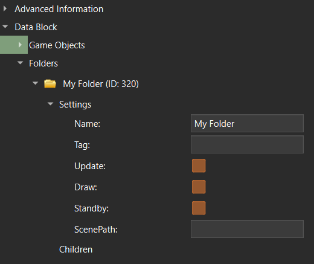

     
- Reference an external .scn file. 

    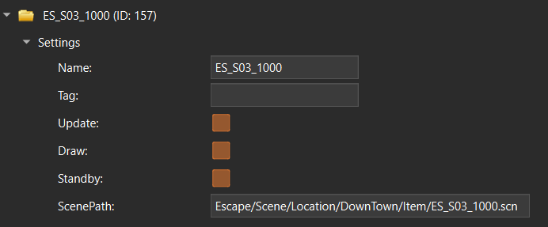

     

- Contain other Folders/GameObjects.

    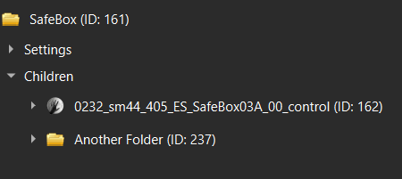

---

 

## REasy Folder Operations

<strong>Create A Folder</strong>

You can create a Folder either:

- By right-clicking the main "Folders" node and creating a normal Folder:

    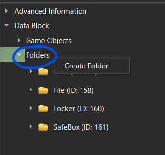

 

- By right-clicking any Folder and creating a sub-Folder:

    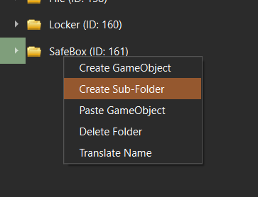
    
 

---

<strong>Delete A Folder</strong>

 

When deleting a Folder, all of its children will be deleted (nested sub-Folders and GameObjects). 

Right click the Folder then choose **Delete Folder**:

    

---

<strong>Create A Child GameObject</strong>

 

To create a GameObject under a Folder, first right click the Folder and choose **Create GameObject**:

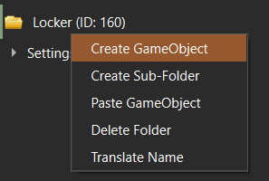

 

Then choose a name for the new GameObject, and click **OK**:

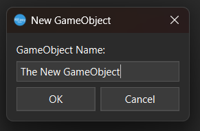

 

You will see the new GameObject in the **children** node of your Folder:

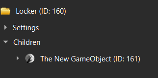

 

--- 

<strong>Paste GameObject into Folder</strong>

If you have previously copied a GameObject, you can paste it as a child in your Folder.
It will then appear in the **children** node.

 

---

<strong>Translate Folder Name</strong>

You can translate names of Folders (make sure to choose your preferred language in **File**>**Settings**).

First, right click the Folder and choose **Translate Name**:

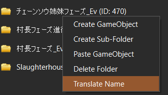

 

You will then see the name in your chosen language (English here):

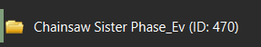

 

---

<strong>Enable/Disable Folders</strong>

There are usually 3 toggles (**Update**, **Draw** and **Standby**).

When a Folder is disabled, it will not be used and none of its children will be active.

Make sure to have all three toggles enabled if you want a folder to be active:

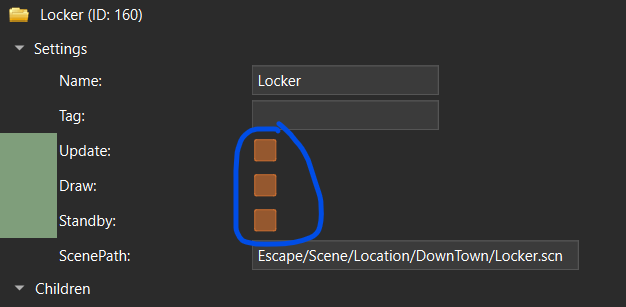

