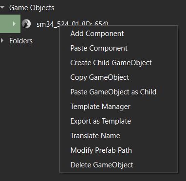
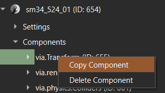
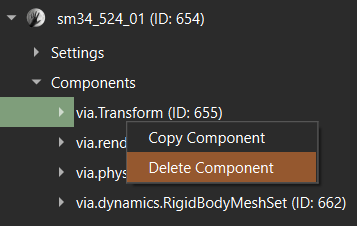
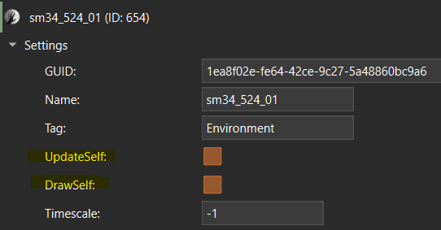

[⬅️ Back to RSZ Editor](./RSZ-Editor.md)

# GameObjects

## Table of Contents

- [What are GameObjects?](#what-are-gameobjects)
- [GameObject Types](#gameobject-types)
- [GameObject Operations](#gameobject-operations)
  - [Add a New Component](#add-a-new-component)
  - [Paste a Previously Copied Component](#paste-a-previously-copied-component)
  - [Copy Component](#copy-component)
  - [Delete Component](#delete-component)
  - [Create a Child GameObject](#create-a-child-gameobject)
  - [Copy the GameObject](#copy-the-gameobject)
  - [Paste Another GameObject from Clipboard as a Child](#paste-another-gameobject-from-clipboard-as-a-child)
  - [Export the GameObject as a Template to Template Manager](#export-the-gameobject-as-a-template-to-template-manager)
  - [Translate the Name of the GameObject](#translate-the-name-of-the-gameobject)
  - [Associate a Prefab to the GameObject (or Modify Existing Prefab Path)](#associate-a-prefab-to-the-gameobject-or-modify-existing-prefab-path)
  - [Enable/Disable GameObject](#enabledisable-gameobject)
  - [Delete the GameObject](#delete-the-gameobject)

---

## What are GameObjects?

Show/Hide

GameObjects are the fundamental building blocks in both `.pfb` (Prefab) and `.scn` (Scene) files.

- In **.pfb files**, a GameObject never has a prefab attached, because it defines the prefab itself.  
    A prefab is a template for creating objects with predefined properties and components. It allows for easy reuse and instantiation of complex objects.

- In **.scn files**, GameObjects can represent a wide variety of entities, such as:
  - Enemies
  - Map objects
  - Controllers (e.g., spawn controllers that define conditions for enemy spawning)
  - Other interactive or static elements in the scene

Each GameObject should have a unique **GUID** assigned to it in its `settings` node. This ensures proper identification and referencing by the game.

GameObjects are used to structure and organize the data and logic within both prefabs and scenes.

---

## GameObject Types

Show/Hide

GameObjects in RSZ files can be:

- **Root GameObjects**  
  - Located directly under the Data Block or inside a Folder.
  - Serve as main entities in the Scene.

- **Child GameObjects**  
  - Part of another GameObject, listed under its `children` node.
  - Can represent:
    - Physical objects attached to the main object.
    - Before/After patterns (e.g., a child GameObject named "before" and another named "after" to represent states such as pre- and post-explosion).
    - Param GameObjects that control the behavior or properties of the parent GameObject.
    - Other specialized roles depending on the context/game.

---

## GameObject Operations

### Add a New Component

Show/Hide

Add a new component to the selected GameObject to extend its functionality.

---

### Paste a Previously Copied Component

Show/Hide

Insert a component from the clipboard into the current GameObject.

---

### Copy Component

Show/Hide

To copy a component, navigate to the **Components** node under the GameObject and right-click the component you want to copy.  
Select **Copy Component** from the context menu.

---

### Delete Component

Show/Hide

To delete a component, navigate to the **Components** node under the GameObject and right-click the component you want to delete.  
Select **Delete Component** from the context menu.

---

### Create a Child GameObject

Show/Hide

Add a new GameObject as a child under the selected GameObject.

---

### Copy the GameObject

Show/Hide

Copy the selected GameObject to the clipboard for duplication or transfer.

---

### Paste Another GameObject from Clipboard as a Child

Show/Hide

Insert a copied GameObject as a child under the current GameObject.

---

### Export the GameObject as a Template to Template Manager

Show/Hide

Save the GameObject as a reusable template for future use.

---

### Translate the Name of the GameObject

Show/Hide

Automatically translate the GameObject's name to your preferred language.

---

### Associate a Prefab to the GameObject (or Modify Existing Prefab Path)

Show/Hide

Link a prefab to the GameObject or change the path of an existing prefab association.

---

### Enable/Disable GameObject

Show/Hide

To enable a GameObject, make sure both **UpdateSelf** and **DrawSelf** are toggled on under its `settings` node.  
Disabling a GameObject will deactivate it and its children.

---

### Delete the GameObject

Show/Hide

Remove the GameObject and all its children from the file.

---

[⬅️ Back](RSZ-Editor.md) | [⬆️ Top](#gameobjects)