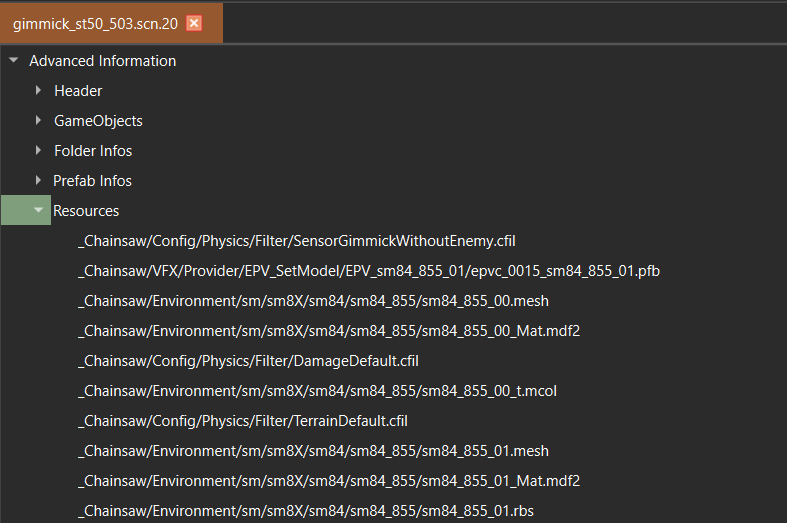
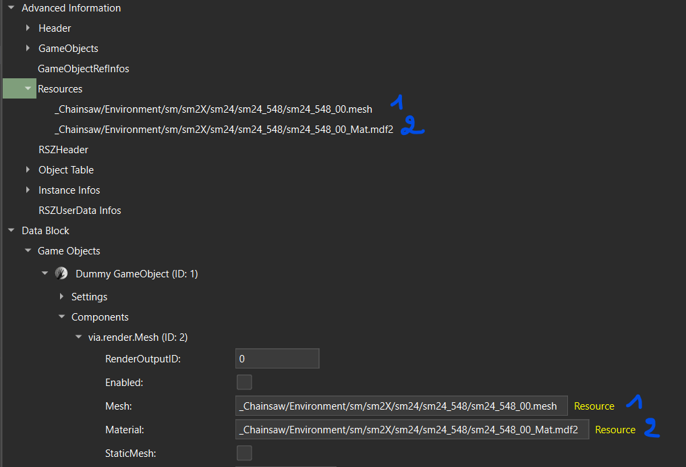
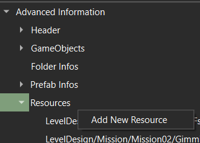
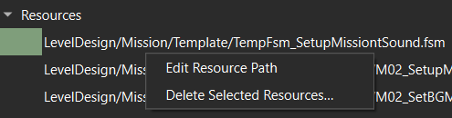

[⬅️ Back to RSZ Editor](./RSZ-Editor.md)

# Resources

## What are Resources in RSZ files?

Show/Hide

Resources in RSZ files are paths to various resource files used by the game.  
These can include:
- **Textures** (`.tex`)
- **Motion banks** (`.motbank`)
- **Mesh files** (`.mesh`)
- And more

Resources occur in:
- `.pfb` files
- `.scn` files
- `.user` files

---

## Resource Management

Show/Hide

### Automatic REasy Management

Show/Hide

Some games support automatic resource management:
- Resources used in instances will be automatically detected and saved under **Resources** in the **Advanced Information** node each time the file is saved.
- This is only available when all Resource fields in the game's RSZ dump are identified (currently RE4, RE8, both versions of RE2/RE3/RE7).

### Manual Resource Management

Show/Hide

If the game's RSZ template is not complete, you must manage resources manually:

- **To add a new resource:**  
  Go to the **Advanced Information** root node and right-click **Resources**.  
  You can then use the resource in your instances in **Data Block**.

  

- **To edit or delete a resource:**  
  Go to the **Resources** node and right-click your desired resource.  
  Make sure to also edit or delete all its occurrences in instances inside **Data Block**.

  

---

## Important Notes

- The same resource can be used in multiple instances without needing to be mentioned multiple times in **Advanced Information > Resources**. Only one entry is needed.
- Invalid resource paths might lead to infinite loading.
- Using resources in instances (in **Data Block**) without registering them in **Advanced Information > Resources** will lead to infinite loading.
- You cannot manually edit resources in games where automatic resource management is enabled. 
- When a field of an instance is of type Resource, it will be marked on the right in yellow "Resource". Note that not all resource fields are yet identified since many RSZ templates are incomplete. Therefore, the absence of the yellow "Resource" marking does not necessarily mean the field is not a resource.    
---

[⬅️ Back](RSZ-Editor.md) | [⬆️ Top](#prefabs)
