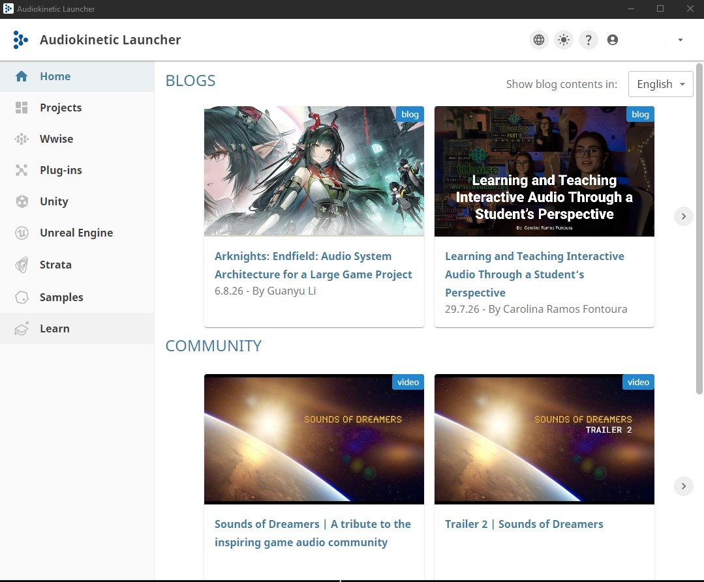
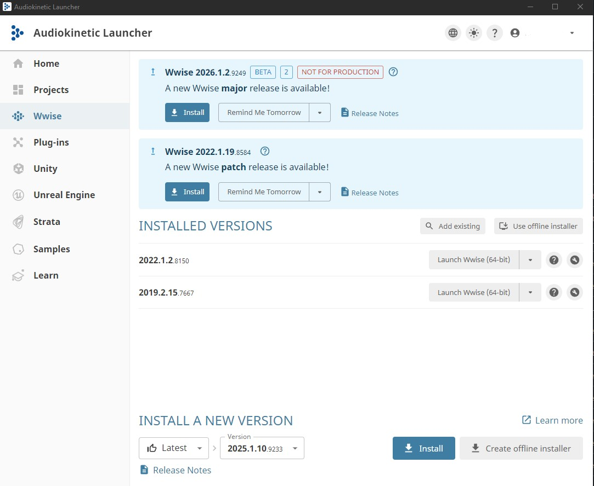
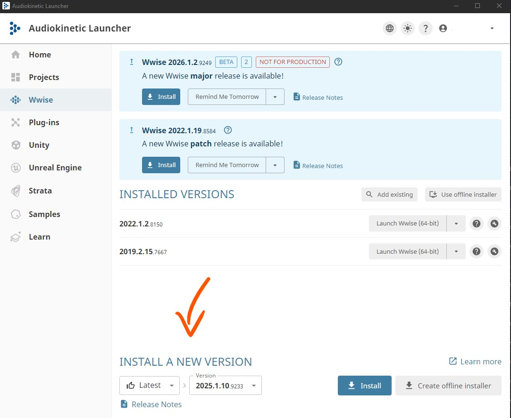
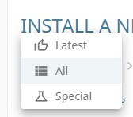
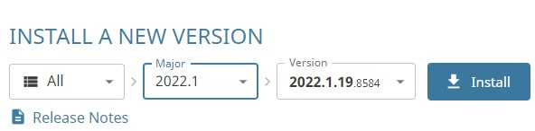
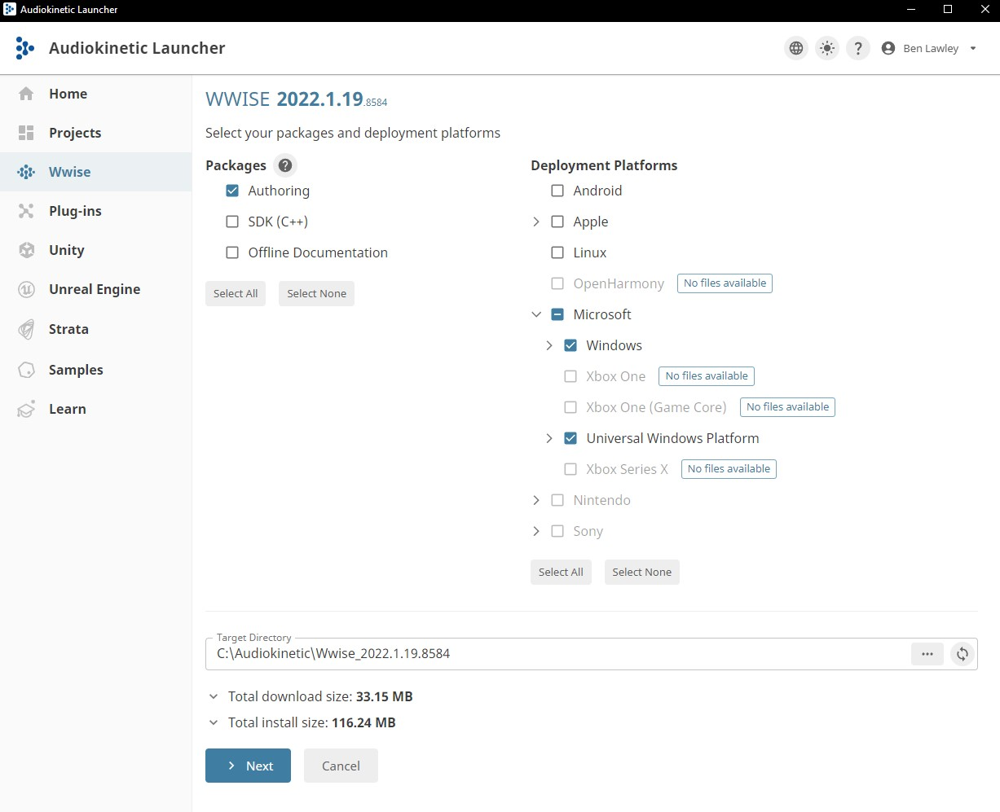
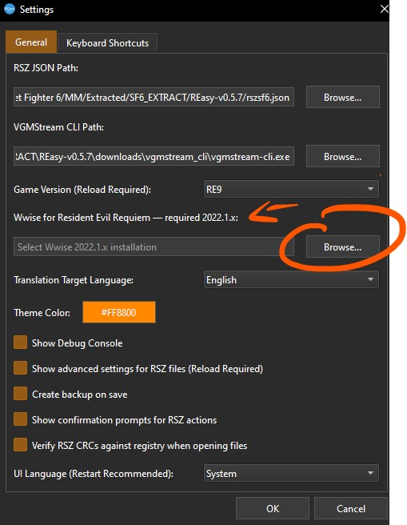
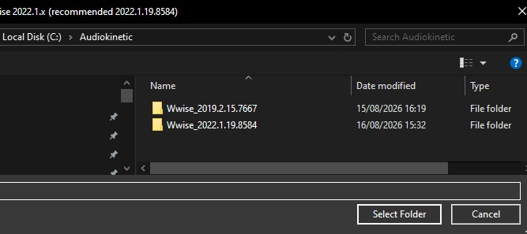

[⬅️ Back to REasy GUI Documentation](./README.md)

# REasy Settings

This page gives an overview of the available settings in REasy and explains when they may need to be changed.

Open the Settings window from:

**File → Settings**

<p align="center">
  <br>
  <em>Captured in REasy 0.7.6</em>
</p>

---

## Game Version

Select the RE Engine game you are currently working with.

REasy uses this selection to load the appropriate game-specific data and file definitions.

Changing the selected game may require REasy to reload the relevant data.

For information about supported games and the Resident Evil RT / non-RT versions, see the **Getting Started** guide.

---

## Translation Target Language

Controls the language used when REasy displays translated game data.

For example:

`English`

This setting is separate from the language used by the REasy interface itself.

---

## UI Language

Controls the language used by the REasy interface.

The default setting is:

`System`

REasy GUI currently supports:

- English
- Chinese

When set to **System**, REasy will use an appropriate supported language based on your operating system language.

---

## VGMStream CLI Path

VGMStream is used by REasy to preview supported game audio.

This field will normally be blank on a fresh installation.

You do not need to manually install VGMStream before using REasy. When audio playback requires it, REasy can automatically download the VGMStream CLI.

The automatically downloaded executable is stored inside the REasy folder at:

```text
..\downloads\vgmstream\_cli\vgmstream-cli.exe
```

Once installed, the path will be shown in the **VGMStream CLI Path** setting.

You can also use **Browse** to select an existing `vgmstream-cli.exe` installation manually.

> A separate guide will cover **previewing game audio in REasy**.

---

## Wwise Installation

Wwise is used when creating replacement audio for supported games.

Unlike VGMStream, Wwise is **not automatically installed by REasy**.

Different RE Engine games can require different major versions of Wwise. REasy will indicate the required Wwise version for the currently selected game.

You can install more than one Wwise version through the Audiokinetic Launcher if you work with multiple games.

<details>
<summary><strong>Installing and Configuring Wwise</strong></summary>

<br>

### 1. Download the Audiokinetic Launcher

Go to the official Audiokinetic download page:

https://www.audiokinetic.com/en/download/

Download the **Audiokinetic Launcher** for your operating system and install it.

---

### 2. Sign In to Audiokinetic

Launch the **Audiokinetic Launcher**.

Sign in with your Audiokinetic account, or create one if you do not already have an account.

<p align="center">
  <br>
  <em>Audiokinetic Launcher Home</em>
</p>

---

### 3. Open the Wwise Section

From the menu on the left side of the Audiokinetic Launcher, select:

**Wwise**

<p align="center">
  <br>
  <em>Wwise section in the Audiokinetic Launcher</em>
</p>

---

### 4. Install a New Version

Under:

**Install a New Version**

open the version filter.

<p align="center">
  
</p>

If the Launcher is currently showing only the latest releases, change the filter to:

**All**

<p align="center">
  
</p>

This is important when installing an older version of Wwise required by a particular game.

---

### 5. Select the Required Major Version

Select the **Major Version** required by the game you are modding.

REasy will display the required version for the currently selected game.

<p align="center">
  
</p>

Do **not** simply install the latest Wwise version unless it matches the version required by your game.

Once you have located the correct version, click:

**Install**

---

### 6. Select the Required Packages

The package selection screen can vary slightly depending on the Wwise version being installed.

Make sure **Authoring** is selected if it is presented as an installation option.

<p align="center">
  
</p>

Click:

**Next**

Continue through the remaining installation screens using the default options unless you have a specific reason to change them.

Allow the Audiokinetic Launcher to finish downloading and installing Wwise.

---

### 7. Configure Wwise in REasy

Return to:

**REasy → File → Settings**

Under **Wwise Installation**, click:

**Browse**

<p align="center">
  
</p>

REasy will normally open the default Wwise installation location on your system.

Select the folder containing the Wwise version you installed.

<p align="center">
  
</p>

Confirm the folder selection.

REasy can now use that Wwise installation for supported audio replacement operations.

</details>

> A future **Audio Replacement** guide will cover using Wwise with REasy to prepare and replace game audio.

---

## Theme Color

Changes the accent colour used throughout the REasy interface.

This setting is purely visual and can be changed to your preference.

---

## Show Debug Console

Controls whether the Debug Console is displayed at the bottom of the REasy window.

This is enabled by default.

The console displays additional information while REasy is running and can be useful for troubleshooting errors or checking what REasy is doing while loading or processing files.

Leaving this enabled is recommended.

---

## Show Advanced Settings for RSZ Files

Enables additional controls when working with RSZ-based file formats.

These options are intended for more advanced editing and can normally be left at their default setting unless specifically required.

---

## Create Backup on Save

Controls whether REasy creates a backup copy when saving modified files.

Leaving this enabled is recommended, particularly when experimenting with unfamiliar file types or RSZ structures.

---

## Show Confirmation Prompts for RSZ Actions

Controls whether REasy asks for confirmation before performing certain RSZ editing actions.

This can help prevent accidental changes.

---

## Verify RSZ CRCs Against Registry When Opening Files

Enables additional CRC validation when opening supported RSZ files.

This can normally be left at its default setting unless troubleshooting or a specific workflow requires it.

---

## Reset Settings

The **Reset Settings** option restores the REasy settings to their default values.

This can be useful if several settings have been changed and you want to return to the default configuration.

---

[⬅️ Back to REasy GUI Documentation](./README.md) | [⬆️ Top](#reasy-settings)
